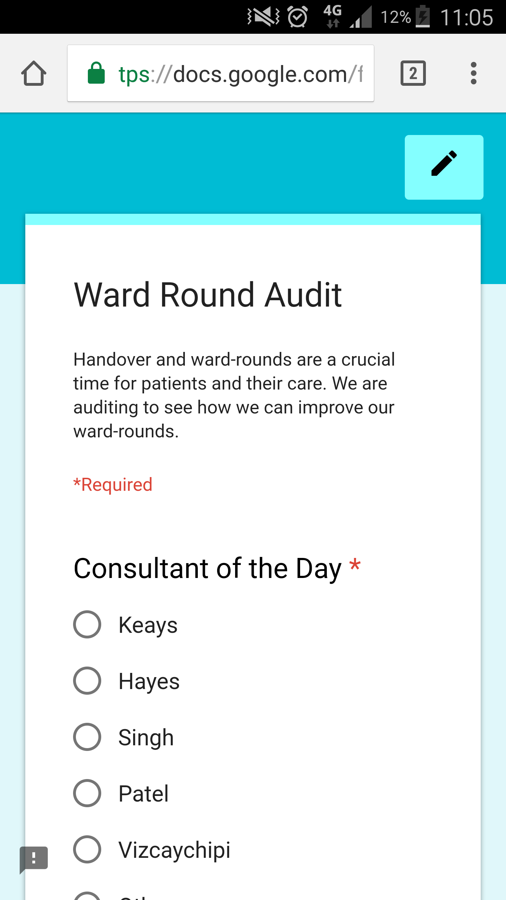
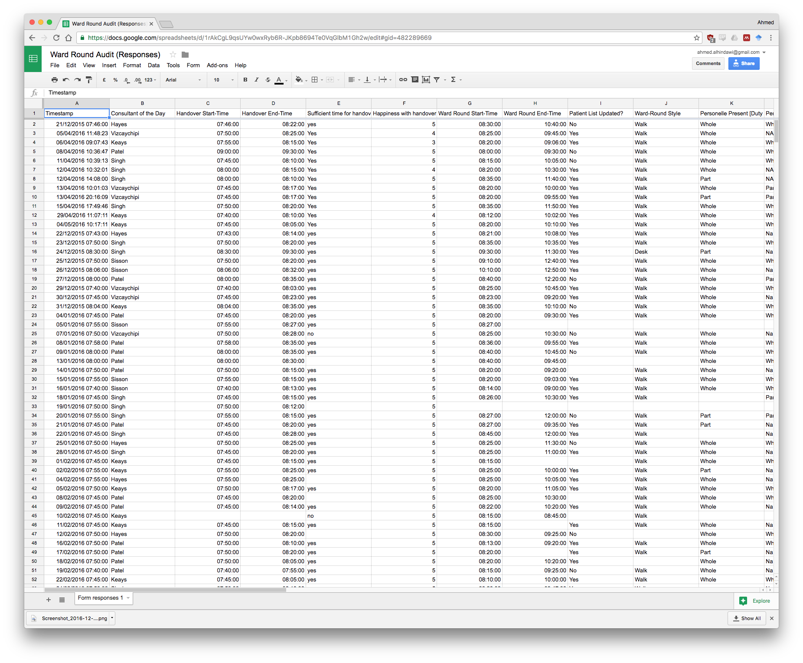
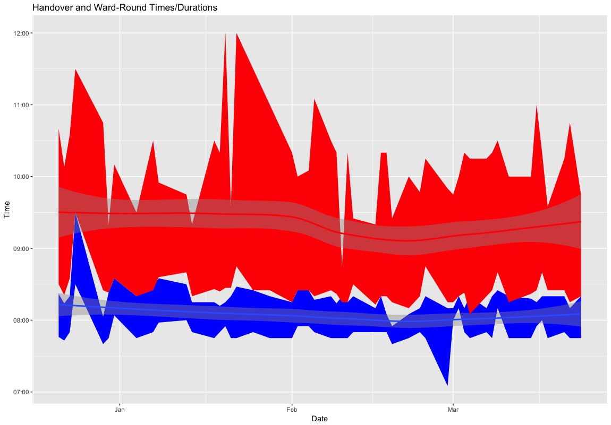
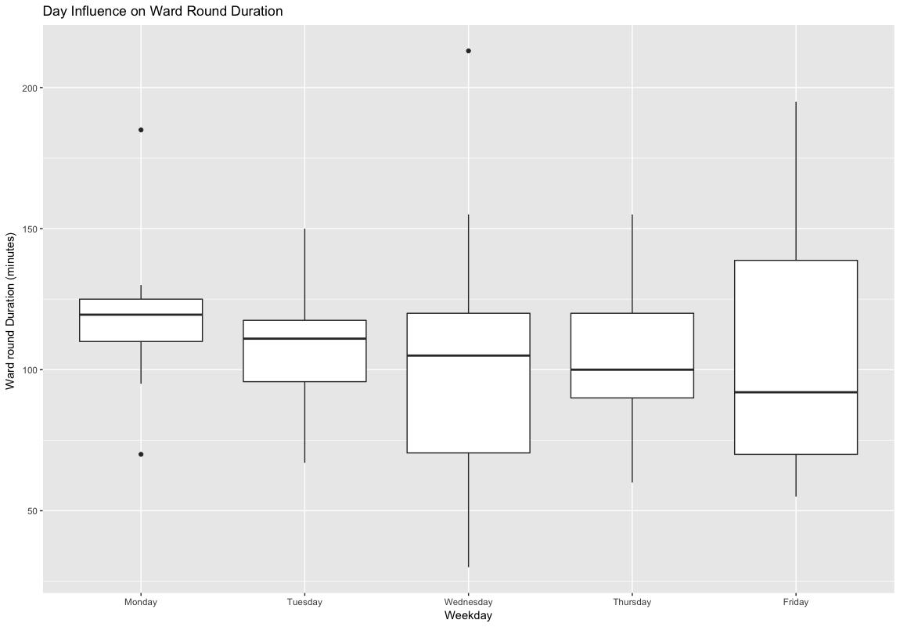

## Automating the boring stuff

- Quality improvement project aimed at improving ward rounds on ICU
- Can't always be there to record data myself
- Everyone has a mobile phone

## Google Forms to the rescue

- Made a Google form
    + Automatic _data validation_ so that no wrong entries or mispellings
    + Resizes automatically to the device (computer, iOS, Android)
    + Automatic date/time entry
- Imports straight into a spreadsheet
- Import that into R
- Analyse the data when I'm away
- NO PATIENT IDENTIFIERS!!

## Google Forms

## Google Sheets

## Analysis

- The Google Sheet was fed into an R script
- Performs some analysis
    + Ward round duration
    + Number of personelle
- Draws lovely graphs!

## Graphs

## Graphs

## Lessons
- Little work at the beginning of the audit led to a dramatic reduction in ongoing effort
- Distributed Audit work
- All audits in Chelsea&Westminster ICU are now in this pipeline
- Future work is to provide a similar Google Forms/Sheets experience but for local secure storage to facilitate patient identifiable information