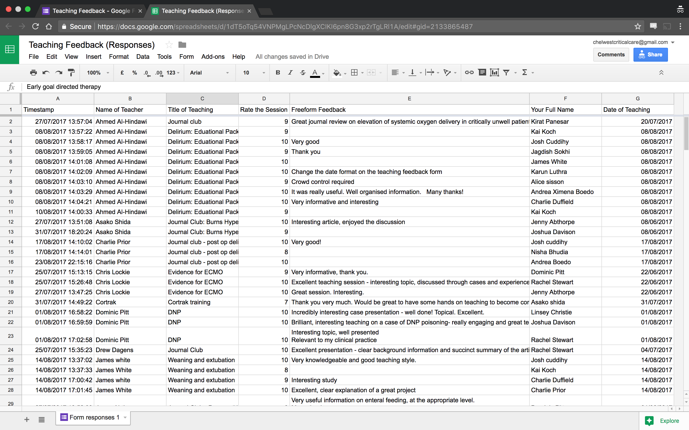
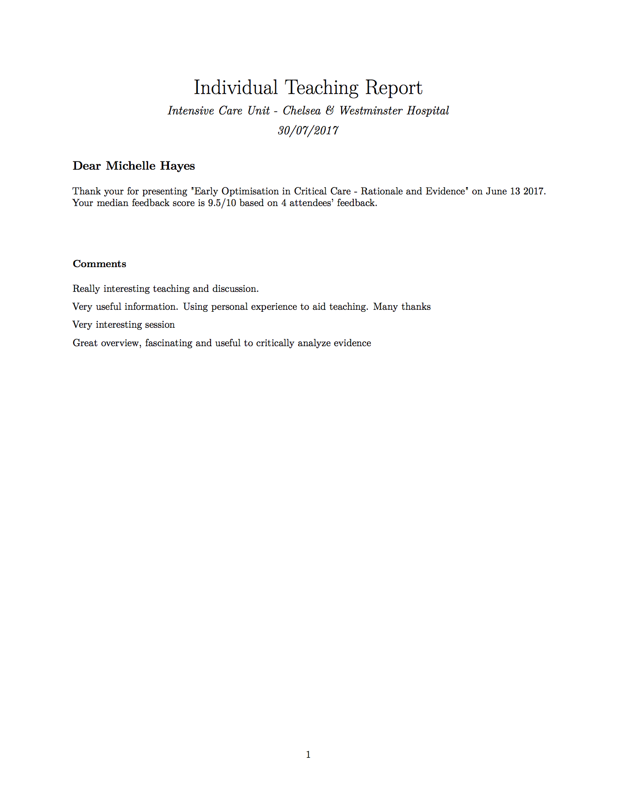

## Two Projects

- Quality improvement project aimed at improving ward rounds on ICU
- Teaching feedback/attendance

## Automating the boring stuff

- Can't always be there to record data myself
- Everyone has a mobile phone

## Project 1 - Ward rounds!

- MDT ward rounds occurs every day
- Variable disciplines attending
- Who? When? How frequent?

## Google Forms to the rescue

- Made a Google form
    + Automatic _data validation_ so that no wrong entries or mispellings
    + Resizes automatically to the device (computer, iOS, Android)
    + Automatic date/time entry
- Imports straight into a spreadsheet
- Import that into R
- Analyse the data when I'm away

## Google Forms

## Google Sheets

## Analysis

- The Google Sheet was fed into an R script
- Performs some analysis
    + Ward round duration
    + Number of personelle
- Draws lovely graphs!

## Graphs

## Graphs

## Lessons
- Little work at the beginning of the audit led to a dramatic reduction in ongoing effort
- Distributed Audit work
- All audits in Chelsea&Westminster ICU are now in this pipeline
- Future work is to provide a similar Google Forms/Sheets experience but for local secure storage to facilitate patient identifiable information

## Project 2 - Teaching QIP

- Aimed at improving the quality of feedback and provide attendance certificates

## Google Forms

- Uses google forms again for collection of data
- QR code at end of presentation sends attendees to form

## Google Sheets

## R script

- R script pulls in data
- Templates made for attendance and for feedback using RMarkDown
- Dplyr/stringr used for data manipulation/gathering
- Output into PDF
- Distributed by email

## Generated Feedback Form

## Generated Attendance Reports

## Lessons

- Must get people to fill in forms as quickly as possible
- Pipeline requires to manually run the script - working on a way to automating that
  - Any suggestions?
- Possibility of emailing the feedback forms automatically
