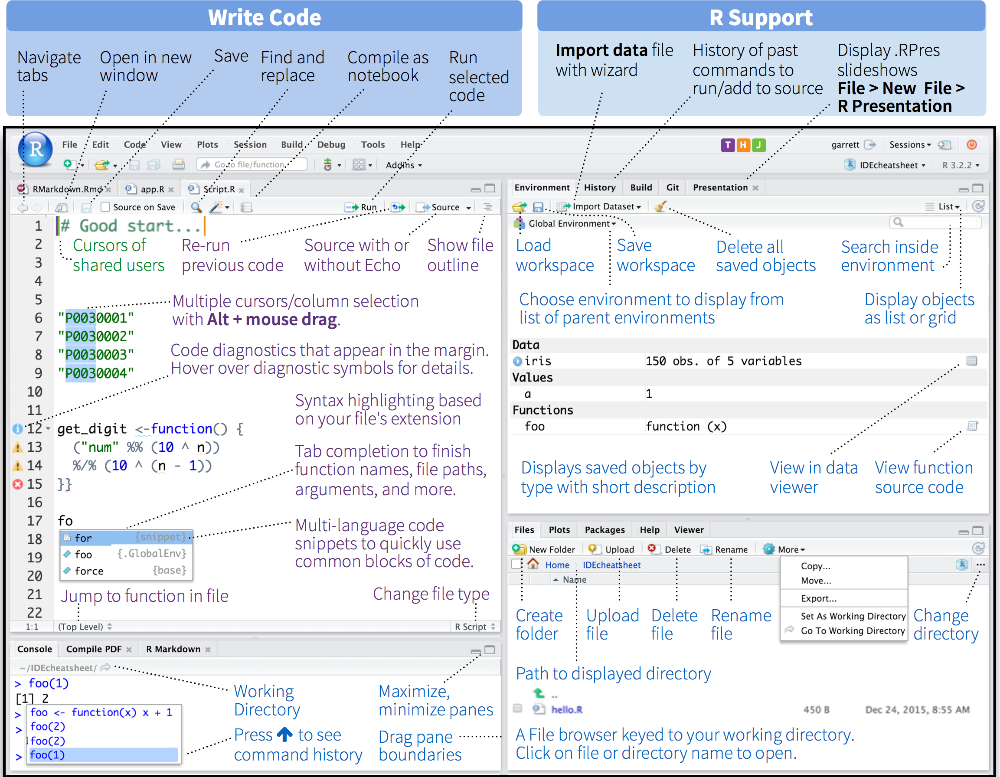
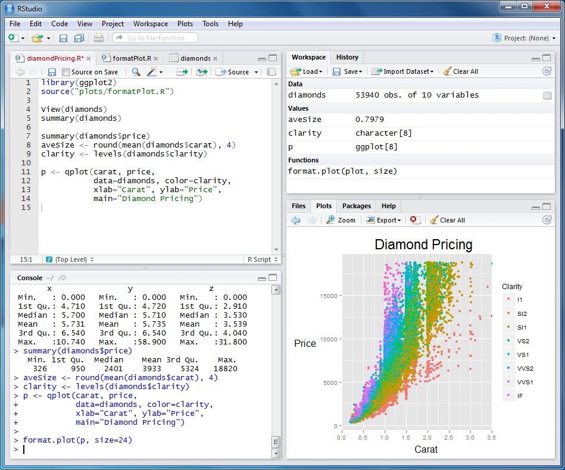
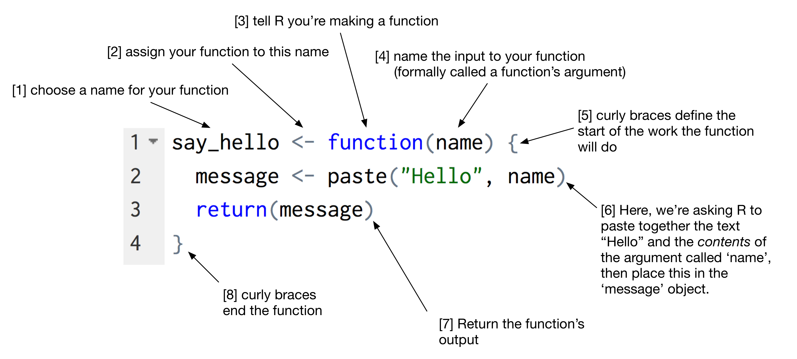

<!-- - [ ] TODO(2016-05-19): factors and lists -->

## Learning Objectives 

- [What is R](#what-is-r)
- [Why R](#why-r)
- [Find your way around RStudio](#start-rstudio-and-have-a-look-around)  
- [R building blocks](#r-building-blocks)

## Lesson 

<a name="what-is-r"></a>

### What is R?

R is a free software environment for statistical computing and graphics. It works with a wide variety of UNIX platforms, Windows and MacOS. It has numerous advantages over other computer languages that make it particularly well suited to statistics.

---

<a name="why-r"></a>

### Why R?

This is the long-story short version, but see [here](why-r.html) for more detail.

Why do people think R is hard? Because it's not a graphical user interface or GUI (pronounced gooey). No more point and click. You have to describe what tasks you want the computer to complete in text, using the language of R. Sounds like a disadvantage? We want to convince you otherwise.

Three good reasons:

- You can do **anything** in R. If R is an entire language, we want to teach you how to become fluent. Once versed in this language you can tell the computer to do anything you can think of. In a GUI environment, someone has had to anticipate what you will want to do ahead of time, and tanslate a button push into a specific command. It's a little like going abroad armed with only a few flash cards to interact with the locals. Wouldn't you rather want to have a conversation in their native language?
- **Science should be reproducible**. You can't record point and clicks. But you can re-run your 'code'. How many times have you trawelled through your data to produce a graph, only to return to it months later and have no idea how you produced it? This isn't an issue in R, as your code tells a permanent story as to how you arrived at your results.
- **Long term gain from upfront investment**. If you have ever worked hard preparing a table or a graph, and then discovered that either you have a new data point to add, or the next month's results are available then the GUI approach means starting all the pointing-and-clicking from scratch. But write it down once, re-run as often as you wish.

The underlying principle of what we want to show you is how to build a data pipeline. You start with your data in a spreadsheet. You write a bunch of instructions (a script) using the R language. Your script produces an output (a table or a figure). Run your script. Generate your output. Change your data. Run the _same_ script. Instantly re-generate your updated output.

---

<a name="start-rstudio-and-have-a-look-around"></a>

### RStudio - Making R a Breeze

RStudio is an application layer that sits ontop of R. It gives you some of the convenience of having a GUI, but with full access to the power of R. RStudio is a set of integrated tools designed to help you be more productive with R. It includes, to name a few:
- a console (runs R)
- syntax-highlighting editor that supports direct code execution (helps make R more readable to humans)-- tools for plotting
- a history of your actions
- workspace management
- debugging tools



<!--  -->

The screen should be divided in quadrants or panes. The two most important are labelled _Source_ (top left), and _Console_ (bottom left). On the right are supporting panes with tabs for finding help, and inspecting your files. If you can't see 4 panes then try clicking the 'minimise'/'maximise' icons in the top right corners of each pane.

There's a handy cheat sheet for R studio available [here](https://www.rstudio.com/wp-content/uploads/2016/01/rstudio-IDE-cheatsheet.pdf). 

> **Exercise:** Find the files tab and navigate to your project. If not already present, set up your project folder structure (I use folders for each of plots, data, reports and code). Navigate to your 'code' folder and then click on the 'more' button and select 'Set as working directory'.

#### Console (bottom left)

The console _is_ R! Type anything here, and it will be interpreted by R.

Try typing `2+2`

     > 2+2
    [1] 4

There are 4 things to explain in the little code snippet above.

1. The command prompt "`>`" (or greater than sign to you and me) is simply R prompting you to enter some text
2. The expression `2+2` is the sum that we asked R to perform.
3. We'll come back to the `[1]` at the beginning of the next line in a moment.
4. R prints the answer `4`

Re-assuring as it is that R knows that `2+2=4`, you were probably hoping for a little more. Typing directly into R is a start, but we want to teach you _reproducible_ research. The scientific method requires that we document our work, but we can't reproduce your typing unless we record it somewhere. 

> **TIP:** Use the up and down arrow keys to go backwards and forwards in your 'command' history to quickly fix typos.

<a name="keep-a-lab-book-of-your-work"></a>

#### Source (top left)

The solution is to create a file, write your commmands in that file, and then tell R to work through the commands in that file. Switch to the pane labelled source, and this time type `2-2`. 

Now typing `enter` brings you to a new line. But go back to the line with `2-2` and hit `command-enter` (on Windows `control-enter`) instead. This sends the last line you wrote from the 'source' document, to the console. You should now see that R can add and substract!

    > 2+2
    [1] 4
    > 2-2
    [1] 0

Now save the file you have written as `labbook_YYMMDD.R` (replace YYMMDD with today's date e.g. `labbook_160103.R`). You must use the `.R` extension to indicate that this is an R script, but you can, of course, choose any name you wish.

The console is also called an _interactive_ R session. What you type here is gone when you close down R. The source pane is simply a view into a text file (with the `.R` extension) that allows you to document, edit, correct and _most importantly_ save your work. The next time you come back to R, you re-open the file, and replay your commands. Got it? Then you're now starting to follow the principles of reproducible research.

---

### Files and directories

It's going to be helpful to have an understanding of how files and folders (aka directories) are named on your computer because unlike your usual habit of pointing and clicking to open something, we will need to start writing things down.

- Directories (folders) contain files and other directories.
- Files have a 'name', and an 'extension' (traditionally a three letter code telling the computer what sort of file it was)
- The 'root' directory is the start of this tree.
    + On Windows machines you'll be used to thinking of the root as the `C:\` drive (a back slash)
    + On a Unix machine (Mac OS X and Linux), the root is just `/` (a forward slash)
- You can write the _absolute_ 'path' to any file as if you walked along the branch of the tree from the 'root' to the file. For example, if you saved a Word document on your desktop called `readme.docx`:
    + Windows: `C:\Users\steve\desktop\readme.docx`
    + Unix: `/Users/steve/desktop/readme.docx`
- You can write the _relative_ 'path' to any file using your current position as the starting point. This is called your working directory. To move up a directory level you type `..`. For example, if your working directory is your `documents` folder which is at 

    + Windows: `C:\Users\steve\documents`
    + Unix: `/Users/steve/documents`

- And you want to go to the same `readme.docx` file as before. You would type

    + Windows: `..\desktop\readme.docx`
    + Unix: `../desktop/readme.docx`

- which reads as 'go up one level' (the `..`), then go down into a folder called `desktop`, and then to the file called `readme.docx`.
- Finally, the `.` (single not double dot) is just the short cut for the _current_ directory. So `./readme.docx` simply means the file called `readme.docx` in _this_ directory. Seems pedantic but that's computers for you!

You can see the path to any file or directory by right clicking and looking for properties (Windows), or using the 'Get Info' menu item (Mac OS X).

### R building blocks

I want to argue that there are only three building blocks within R.

- names
- data
- functions

#### Names

It's easier to give names to things, and then use the names rather than the thing itself most of the time. We use the `<- ` assignment operator to assign a name. 

> **TIP:** Use _option_ (Mac OS X) or _alternate_ (Windows) and the `-` (minus) key as a short cut to type this in RStudio.

Let `answer` equal `42`

    answer <- 42

Let `msg` equal `Hello World!`

    msg <- `Hello World!`

#### Data

We are about to use a bunch of very 'math-y' words. Please do not be put off!

R is a _statistical computing_ language, and statistics uses vectors and matrices. These are _not_(!) complicated things.

##### Vectors

In R, a vector is a list of things of the same type.

A list of numbers (a number vector):

    1, 4, 9, 16, 25

A list of characters (a character vector):

    "Q", "W", "E", "R", "T", "Y"

A `TRUE` or `FALSE` list  (a logical vector):

    TRUE, FALSE, TRUE, TRUE, FALSE

We _index_ the list by counting from left to right starting with `1` (not `0`). 

To make these vectors in R, we _combine_ the listed elements using `c()`.

    x <-  c("Q", "W", "E", "R", "T", "Y")
    

Now if you want the 3rd element, simply type `x[3]`.

    x <-  c("Q", "W", "E", "R", "T", "Y")
    x[3]
    [1] "E"

Because R _always_ 'thinks' in vectors, even the answer is 'indexed' hence the leading  `[1]`.

> **TRY THIS:** Try typing `1:100`. This is a shorthand way of writing all the numbers between 1 and 100. Look below, and see that the number in square brackes is just R keeping count of the numbers it shows you.

    R> 1:100
      [1]   1   2   3   4   5   6   7   8   9  10  11  12  13  14  15  16  17  18  19  20  21  22  23
     [24]  24  25  26  27  28  29  30  31  32  33  34  35  36  37  38  39  40  41  42  43  44  45  46
     [47]  47  48  49  50  51  52  53  54  55  56  57  58  59  60  61  62  63  64  65  66  67  68  69
     [70]  70  71  72  73  74  75  76  77  78  79  80  81  82  83  84  85  86  87  88  89  90  91  92
     [93]  93  94  95  96  97  98  99 100

##### Data frames

Data frames are many vectors combined in a grad. It's analogous to storing data in an excel spread sheet. So if I have age, sex, and weight data in 3 vectors:

    age <- c(5,7,41,41)
    sex <- c("M", "M", "F", "M")
    weight <- c(16,30,55,78)

Then I can combine them into a _data frame_.

    demographics <- data.frame(age,sex,weight)

Have a look at `demographics`.

    R> demographics
      age sex weight
    1   5   M     16
    2   7   M     30
    3  41   F     55
    4  41   M     78

What's nice is that the `data.frame` _numbers_ the rows, and _names_ the columns.

Moreover, rather than having to use numerical addresses to look at data, you can use the `$` operator to access the columns by name.

> **TRY THIS:** Try typing `demographics$age`

#### Functions

Functions are small specific programmes. They take an input, and give you an output. They perform tasks. To perform a task, they need an input, and the result of their work is the output.

Take a character Ed for example. If we want Ed to move accross the screen, we might write:

    ed.moveforward()
    ed.moveforward()
    ed.moveforward()
    
The function `ed.moveforward` is something we've pre-written to get our character Ed to move forward a single space. The `()` is the instruction to the computer to use that function. It's our 'go' command. This function takes no arguments at present. Arguments are additional pieces of informtion we can give to our function, to make its behaviour more specific. At the moment `ed.moveforward()` moves our character forward by 1 space each time. Lets see if we can pass an argument into our function to improve our efficiency.

    ed.moveforward(by = 3)
    
Now we've given the `ed.moveforward` function it's first argument. This argument tells the function how many spaces it should be moving Ed forward. Let look at how we can write a function. I want Ed to move accross the screen, turn around and move back. We'll need a new function to help us: `ed.turnleft()`

    ed.outandback <- function() {
    	ed.moveforward(by = 3)
    	ed.turnleft()
    	ed.turnleft()
    	ed.moveforward(by = 3)
    }

This is how we write a function. In this instance, we've grouped other useful functions together into a move complex behaviour. If you do this enough, you end up with a computer game. The key features of this are:

- `ed.outandback <-` this is what we are calling our new function, using the assignment operator
- `function()` this tells R to pay attention to the next bit, as you want to write a function
- `{}` everything inside the curly brackets is the contents of your function. We have included a series of functions that will be called in order

Lets run our new function and see what happens:

    ed.outandback()

Let's do a quick clinical example to help consolidate the lesson. Let's say we want to work out BMI from height and weight. We could write a function called `BMI` and pass it the arguments `height` and `weight`. It should end up looking something like this when called:

    BMI(height = 1.72, weight = 80)
    R> [1]
    
Ok, lets write this function

    BMI <- function(height, weight) {
    	x = weight / height^2
    	return(x)
    }
    


R comes with a bunch of functions pre-installed called. These are called 'base R'. However, there are thousands of additional functions packaged together into libraries that you will want to use too. You load these by calling (surprise, surprise) a base R function called `library`.

    library(ggplot2)

---

---

## Exercises

## Questions

1. Can you explain the difference between the console and the source panes in R studio?
2. In RStudio, have a look in the _Environment_ tab of the pane on the top right? What do you think is shown here?
3. Try using the help function to find out what `ls()` does. Hint: try typing this in the search box of the _Help_ pane. Don't worry if the 'help' doesn't make much sense! Or just type `?ls` in the console.


## Home work (!)

Type the following (you'll need a working internet connection).

```
install.packages("swirl")
library(swirl)
swirl()
```

This brings up an interactive R lesson. Choose either R Programming then either option 1 or 2.

```
| Please choose a course, or type 0 to exit swirl.

1: R Programming
2: Take me to the swirl course repository!

Selection: 1

| Please choose a lesson, or type 0 to return to course menu.

 1: Basic Building Blocks      2: Workspace and Files        3: Sequences of Numbers    
 4: Vectors                    5: Missing Values             6: Subsetting Vectors      
 7: Matrices and Data Frames   8: Logic                      9: Functions               
10: lapply and sapply         11: vapply and tapply         12: Looking at Data         
13: Simulation                14: Dates and Times           15: Base Graphics   
```


<!-- - [ ] TODO(2016-05-12): change working directory (point and click, console) -->

