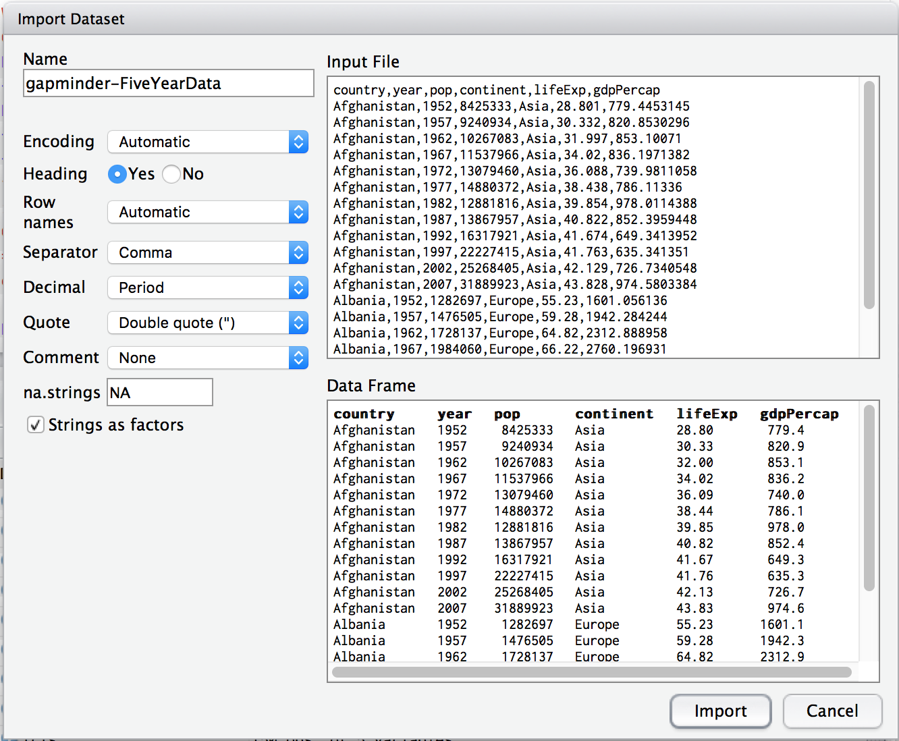
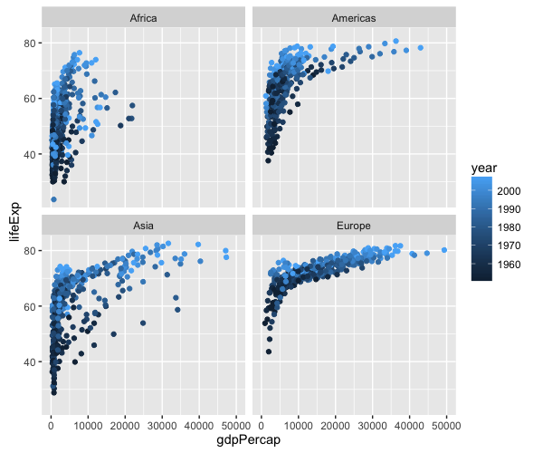

<!-- - [ ] TODO(2016-05-19): factors and lists -->

## Learning Objectives 

- [Why R](#why-r)
- [Find your way around RStudio](#start-rstudio-and-have-a-look-around)  
- [R building blocks](#r-building-blocks)
- [Get your hands dirty](#follow-me)

## Lesson 

<a name="why-r"></a>

### Why R?

This is the long-story short version, but see [here](why-r.html) for more detail.

Why do people think R is hard? Because it's not a GUI (pronounced gooey!). No more point and click. You have to write stuff down. Sounds like a disadvantage? We want to convince you otherwise. 

Two good reasons:

- **Science should be reproducible**. You can't record point and clicks. But you can re-run your 'code'.
- **Long term gain from upfront investment**. If you have ever done a bunch of work preparing a table or a graph, and then discovered that either you have a new data point to add, or the next month's results are available then the GUI approach means starting all the pointing-and-clicking from scratch. But write it down once, re-run as often as you wish.

The underlying principle of what we want to show you is how to build a data pipeline. You start with your data in a spreadsheet. You write a bunch of instructions (a script) using the R language. Your script produces an output (a table or a figure). Run your script. Generate your output. Change your data. Run the _same_ script. Instantly re-generate your updated output. 

---

<a name="start-rstudio-and-have-a-look-around"></a>

### Start RStudio and have a look around

R (does the work) vs RStudio (helps you use R)

- R is a free software environment for statistical computing and graphics. It compiles and runs on a wide variety of UNIX platforms, Windows and MacOS.
- RStudio is a set of integrated tools designed to help you be more productive with R. It includes a console, syntax-highlighting editor that supports direct code execution, as well as tools for plotting, history, debugging and workspace management.


<!--  -->

The screen should be divided in quadrants or panes. The two most important are labelled _Source_ (top left), and _Console_ (bottom left). On the right are supporting panes with tabs for finding help, and inspecting your files. If you can't see 4 panes then try clicking the 'minimise'/'maximise' icons in the top right corners.

There's a handy cheat sheet for R studio available [here](https://www.rstudio.com/wp-content/uploads/2016/01/rstudio-IDE-cheatsheet.pdf). 

> **TRY THIS:** Find the files tab, navigate to the 'code' folder in your project, then click on the 'More' button and select 'Set as working directory'.

#### Console (bottom left)

The console _is_ R! Type anything here, and it will be interpreted by R.

Try typing `2+2`

     > 2+2
    [1] 4

There are 4 things to explain in the little code snippet above.

1. The command prompt "`>`" (or greater than sign to you and me) is simply R prompting you to enter some text
2. The expression `2+2` is the sum that we asked R to perform.
3. We'll come back to the `[1]` at the beginning of the next line in a moment.
4. R prints the answer `4`

Re-assuring as it is that R knows that `2+2=4`, you were probably hoping for a little more. Typing directly into R is a start, but we want to teach you _reproducible_ research. The scientific method requires that we document our work, but we can't reproduce your typing unless we record it somewhere. 

> **TIP:** Use the up and down arrow keys to go backwards and forwards in your 'command' history to quickly fix typos.

<a name="keep-a-lab-book-of-your-work"></a>

#### Source (top left)

The solution is to create a file, write your commmands in that file, and then tell R to work through the commands in that file. Switch to the pane labelled source, and this time type `2-2`. 

Now typing <enter> brings you to a new line. But go back to the line with `2-2` and hit <command-enter> (on Windows <control-enter>) instead. This sends the last line you wrote from the 'source' document, to the console. You should now see that R can add and substract!

    > 2+2
    [1] 4
    > 2-2
    [1] 0

Now save the file you have written as `labbook_YYMMDD.R` (replace YYMMDD with today's date e.g. `labbook_160103.R`). You must use the `.R` extension to indicate that this is an R script, but you can, of course, choose any name you wish.

The console is also called an _interactive_ R session. What you type here is gone when you close down R. The source pane is simply a view into a text file (with the `.R` extension) that allows you to document, edit, correct and _most importantly_ save your work. The next time you come back to R, you re-open the file, and replay your commands. Got it? Then you're now starting to follow the principles of reproducible research.

---

### R building blocks

I want to argue that there are only three building blocks within R.

- names
- data
- functions

#### Names

It's easier to give names to things, and then use the names rather than the thing itself most of the time. We use the `<- ` assignment operator to assign a name. 

> **TIP:** Use _option_ (Mac OS X) or _alternate_ (Windows) and the `-` (minus) key as a short cut to type this in RStudio.

Let `answer` equal `42`

    answer <- 42

Let `msg` equal `Hello World!`

    msg <- `Hello World!`

#### Data

We are about to use a bunch of very 'math-y' words. Please do not be put off!

R is a _statistical computing_ language, and statistics uses vectors and matrices. These are _not_(!) complicated things.

##### Vectors

In R, a vector is a list of things of the same type.

A list of numbers (a number vector):

    1, 4, 9, 16, 25

A list of characters (a character vector):

    "Q", "W", "E", "R", "T", "Y"

A `TRUE` or `FALSE` list  (a logical vector):

    TRUE, FALSE, TRUE, TRUE, FALSE

We _index_ the list by counting from left to right starting with `1` (not `0`). 

To make these vectors in R, we _combine_ the listed elements using `c()`.

    x <-  c("Q", "W", "E", "R", "T", "Y")
    

Now if you want the 3rd element, simply type `x[3]`.

    x <-  c("Q", "W", "E", "R", "T", "Y")
    x[3]
    [1] "E"

Because R _always_ 'thinks' in vectors, even the answer is 'indexed' hence the leading  `[1]`.

> **TRY THIS:** Try typing `1:100`. This is a shorthand way of writing all the numbers between 1 and 100. Look below, and see that the number in square brackes is just R keeping count of the numbers it shows you.

    R> 1:100
      [1]   1   2   3   4   5   6   7   8   9  10  11  12  13  14  15  16  17  18  19  20  21  22  23
     [24]  24  25  26  27  28  29  30  31  32  33  34  35  36  37  38  39  40  41  42  43  44  45  46
     [47]  47  48  49  50  51  52  53  54  55  56  57  58  59  60  61  62  63  64  65  66  67  68  69
     [70]  70  71  72  73  74  75  76  77  78  79  80  81  82  83  84  85  86  87  88  89  90  91  92
     [93]  93  94  95  96  97  98  99 100


##### Matrices

Matrices are just 'strict' versions of your typical spreadsheet tables. Just like a vector, every item is indexed, and by convention the address is _row_ then _column_ (think _'arsey'_, _rc_, _row then column_).

Let's make a matrix.

    x <- matrix(1:12, nrow=3, ncol=4)

Note how we used `1:12` to make a vector of the numbers from `1` to `12` before asking for a 3 row and 4 column matrix. R fills in the matrix by filling each column before moving to the next row.

         [,1] [,2] [,3] [,4]
    [1,]    1    4    7   10
    [2,]    2    5    8   11
    [3,]    3    6    9   12

The address of the `8` is `[2,3]` (row 2, column 3).

##### Data frames

More useful to us are data frames which are just 'mixed' matrices. So if I have age, sex, and weight data in 3 vectors:

    age <- c(5,7,41,41)
    sex <- c("M", "M", "F", "M")
    weight <- c(16,30,55,78)

Then I can combine them into a _data frame_.

    demographics <- data.frame(age,sex,weight)

Have a look at `demographics`.

    R> demographics
      age sex weight
    1   5   M     16
    2   7   M     30
    3  41   F     55
    4  41   M     78

What's nice is that the `data.frame` _numbers_ the rows, and _names_ the columns.

Moreover, rather than having to use numerical addresses to look at data, you can use the `$` operator to access the columns by name.

> **TRY THIS:** Try typing `demographics$age`

#### Functions

Think of functions as litte machines. They perform tasks. To perform a task, they need an input, and the result of their work is the output. 


    R> say_hello("Steve")
    [1] "Hello Steve"

R comes with a bunch of functions pre-installed called. These are called 'base R'. However, there are thousands of additional functions packaged together into libraries that you will want to use too. You load these by calling (surprise, surprise) a base R function called `library`.

    library(ggplot2)

---

<a name="follow-me"></a>

### Get your hands dirty

Congratulations. That was the most 'conceptual' part of the course. Now time to get your hands dirty!

See if you can follow along. We'll type in the code together.

Load some data from [GapMinder](http://www.gapminder.org).

```
ddata <- read.csv(file="https://raw.githubusercontent.com/resbaz/r-novice-gapminder-files/master/data/gapminder-FiveYearData.csv")
```

Tricky to type? First, grab the link from Slack.

- then click on the 'Environment' tab, and find and click the 'Import Dataset button'. Then select the 'From Web URL...' option
- or save the file to you machine, follow the same steps, but select the 'From Local File...' option

Then change the 'name' you are giving to these data to `ddata` (see top left box).



To see the first few rows, type `head`

```
head(ddata)
```

We have data for 142 countries from 5 continents over 60 years.

```
      country year      pop continent lifeExp gdpPercap
1 Afghanistan 1952  8425333      Asia   28.80     779.4
2 Afghanistan 1957  9240934      Asia   30.33     820.9
3 Afghanistan 1962 10267083      Asia   32.00     853.1
4 Afghanistan 1967 11537966      Asia   34.02     836.2
5 Afghanistan 1972 13079460      Asia   36.09     740.0
6 Afghanistan 1977 14880372      Asia   38.44     786.1
```


Load a plotting library called `ggplot2` (The `gg` refers to a famous book by William Cleveland called the 'Grammar of Graphics').

```
library(ggplot2)
```

We will use the `ggplot()` function from the ggplot2 library for plotting. This function needs to be told what data to use, which variable to put on the x-axis, and which on the y-axis. Things like the x-postion, the y-postion, the size and the colour of points are called `aesthetics` in the grammar of graphics.

Let's plot life expectancy against wealth (GDP).

```
ggplot(data=ddata, aes(x=gdpPercap, y=lifeExp))
```

Notice how we are passing the data and the aesthetics as `arguments` to the function. But so far, this just makes an 'empty' plot. 

Next you tell ggplot what sort of plot (called a 'geometry') you want.

```
ggplot(data=ddata, aes(x=gdpPercap, y=lifeExp)) + geom_point()
```

Want to see how this varies by continent? Try 'facetting' which means drawing mini-plots for each group.

```
ggplot(data=ddata, aes(x=gdpPercap, y=lifeExp)) + geom_point() + facet_wrap(~continent)
```

What about how things change over time? Add a new aesthetic (colour) for the `year` variable.

```
ggplot(data=ddata, aes(x=gdpPercap, y=lifeExp, colour=year)) + geom_point() + facet_wrap(~continent)
```

Would you like to make the plots easier to read by hiding the outliers?

```
ggplot(data=ddata, aes(x=gdpPercap, y=lifeExp, colour=year)) + geom_point() + facet_wrap(~continent) + coord_cartesian(x=c(0,50000))
```


And drop Oceania (there's not much data). We'll use another library called 'dplyr' that allows us to 'filter' the data easily.

> **TIP:** the `!=` operator means 'not equal to' so the statement below could be read as assign the name `data.4c` to the data made by filtering out all rows where the continent is _not equal_ to 'Oceania'.

```
library(dplyr)
data.4c <- filter(ddata, continent!="Oceania") 
```

Now plot with the _updated_ data.

```
ggplot(data=data.4c, aes(x=gdpPercap, y=lifeExp, colour=year)) + geom_point() + facet_wrap(~continent) + coord_cartesian(x=c(0,50000))
```



Cause for optimism? Or just home time? You have finished. See you next week.


OK? No! Nothing happened. Aren't functions supposed to do something? In this case, ggplot prepares the data for the graph. Now you need to `tell` ggplot what sort of graph you want.

Let's make a scatter plot.


---

## Exercises

## Questions

1. Can you explain the difference between the console and the source panes in R studio?
2. In RStudio, have a look in the _Environment_ tab of the pane on the top right? What do you think is shown here?
3. Try using the help function to find out what `ls()` does. Hint: try typing this in the search box of the _Help_ pane. Don't worry if the 'help' doesn't make much sense! Or just type `?ls` in the console.


## Home work (!)

Type the following (you'll need a working internet connection).

```
install.packages("swirl")
library(swirl)
swirl()
```

This brings up an interactive R lesson. Choose either R Programming then either option 1 or 2.

```
| Please choose a course, or type 0 to exit swirl.

1: R Programming
2: Take me to the swirl course repository!

Selection: 1

| Please choose a lesson, or type 0 to return to course menu.

 1: Basic Building Blocks      2: Workspace and Files        3: Sequences of Numbers    
 4: Vectors                    5: Missing Values             6: Subsetting Vectors      
 7: Matrices and Data Frames   8: Logic                      9: Functions               
10: lapply and sapply         11: vapply and tapply         12: Looking at Data         
13: Simulation                14: Dates and Times           15: Base Graphics   
```


<!-- - [ ] TODO(2016-05-12): change working directory (point and click, console) -->

