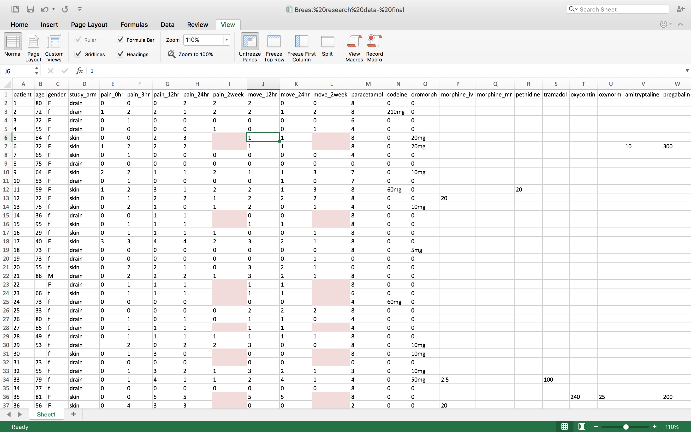
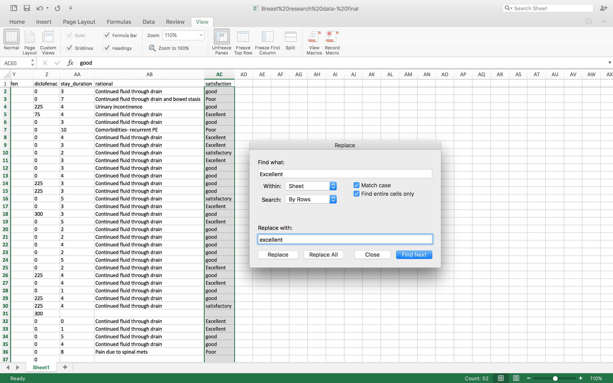

## Learning Objectives 

<!-- Enumerate specific learning objectives in terms of what the learner will be able to completed by the end of the lesson -->

<!--     * Excel Hell - (v1) Ed (v2) 
        - [ ] live coding / practical session tidying a dirty sheet: use the RCT stuff
 -->

By the end of the session, delegates should be able to:

1. Describe some of the basic differences between data types
2. Summarise the pros and cons for different spreadsheet applications for storing your data
3. Demonstrate best practices for recording and formatting data in spreadsheets
4. Understand the correspondence between spreadsheet cells, columns and rows and data observations and values
5. Avoid the common mistakes when recording raw data
6. Be confident in building their own spreadsheet to collect data under best practices

### Prerequisites

You need to have installed either:
- Google Chrome or similar web browser (to use google sheets)
- A spreadsheet programme (Excel, Numbers, or Libre Office Calc etc.)

## Lesson 

- [Introduction](#introduction)
- [Data Types](#data-types)
- [Cardinal rules](#cardinal-rules)
- [Common mistakes](#common-mistakes)
- [Unravelling Data](#bad-data)
- [Exporting to CSV](#worked-example)
- [Testing your spreadsheet](#testing)

## Introduction

Spread sheets offer a simple and effective method to collect data. However, their ease of use often leads to a sloppy approach to data entry. Good data discipline is an essential foundation to data analysis and a small investment at this stage can prevent you running into trouble when trying to analyse and publish your study. This tutorial will take you through the essential dos and don'ts of managing your data in a spreadsheet.

As a word of caution, don't forget, that any data collection should be inline with the Data Protection Act. Please ensure you manage your data appropriately.

### Which application to use?

There are many different spreadsheets to use. Almost everyone will be familiar with excel, although it's worth considering if this is actually the right choice for you. If you are planning a major collaboration, where many people need to enter data simultaneously, then an excel spreadsheet is probably not for you. Have a look at google sheets as an alternative. As your requirements grow, you may want to explore a relational database. But for now, we'll assume you are using excel.

## Data types

In computing terms, not all data is equal. It's worth getting to grips with this now, as any deviation from a set pattern will cause problems later on.

> If in doubt, aim for **consistency in every column**. Never try to record more than 1 "type" of thing in a column.

### Integers & Decimals

Integers are any whole number. Decimals include any number with a decimal point. Computers apply maths differently to these two numerical data types.

### Strings

A string is any sequence of characters. Literally anything you can type can be represented as a string. This is the default data type in excel, and is what data typically defaults to if there is any confusion about what the data is. Take the example of recording the dose of analgesia given for postoperative pain relief. If we write `180 mg`, excel will store this value as a string. It has no choice, since the “mg” adds data that cannot possibly be interpreted numerically. When dealing with data that is numerical in nature, it's best practice to keep all units elsewhere and keep the data as an integer or decimal.

### Date/Time objects

This is essentially a special case of the decimal. Dates are simply integers counted up from a point in time (typically Jan 1st 1970 as convention). Time is given as a fraction of a single day. Obviously it's going to be very difficult for us to record today as `10467.56743`, as it's not remotely intuitive. We can still write the date and time in excel in a conventional way, but it's important to understand how this information is stored. When recording date and time information, it is often easier to separate out the two e.g. store date in a single column (in the format YYYY-MM-DD) and time in another (in the format HH:MM).

> **Top Tip:** If you really want to make life easy in the future, separate out each day, month, year, hour and minute into separate columns. It's a greater investment, but can make handling dates easier in the future.

### Booleans

These are `TRUE` or `FALSE` statements. Mathematically, these are represented by the values `1` or `0` respectively. Strictly speaking, `TRUE` can also take any non `0` value i.e. `1`, `-45`, `750.45` they're all not `0` and hence interpreted as `TRUE`. `FALSE` is ALWAYS `0`. When storing any `TRUE` or `FALSE` data, we recommend using `1` and `0` as a convention.

### Factors

These are a special way of letting R know that the data is nominal or ordinal. Think about a likert scale. You want R to be able to categorise "satisfactory", "good", "excellent" etc. These are a special case of integers (counting numbers) data type, but stored with a label.  Additionally, when the data is ordered (like the likert scale) then an additional 'note' (called an attribute) is made so that R knows the order matters.

An **un**ordered (nominal) factor

- apples
- oranges 
- pears

R stores this as `1,2,3` for convenience but not because `1<2<3`.

An ordered (ordinal) factor such as a Likert scale

- Strongly disagree
- Disagree
- Neither agree/disagree
- Agree
- Strongly agree

R stores this as `1,2,3,4,5` for convenience and understands that `1<2<3<4<5`.

### Cardinal rules

The cardinal rules of using spreadsheet programs for data:

1. Put all your **variables in columns** - the thing you're measuring, like 'weight', 'temperature' or 'SBP'. Break things down into thier most basic constituents, and keep units in your headers only.
2. Put each **observation in its own row**. Think very carefully about what constitutes your basic observation. Often it's your patient, but it may not be as intuitive as you think.
3. **Don't combine multiple pieces of information in one cell**.
4. **Leave the raw data raw** - don't mess with it! That means no formulas anywhere in your spreadsheet!
5. Export the cleaned data to a **text based format** like CSV. This ensures that anyone can use the data, and is the format required by most data repositories.

## Unravelling Data

Let's take the example some data that has already been collected and very kindly donated by one of our course delegates. The data is excellent, but doesn't conform to the necessary rules for working with R. Download this file from [Figshare](https://ndownloader.figshare.com/files/5094199?private_link=aff8f0912c76840c7526).

We can use this data as an example of how to tidy your data in a spreadsheet application to make it ready for import to R. Using the cardinal rules, work in your pairs to tansform this data an appropriate format for exporting to R.

The foundations of this data are good. But there are a few mistakes in how the data is formatted that we need to address.

First, we need to make sure that our headings are all on 1 line, with unique identifiers for head column name, with no spaces or special characters.

Other, more subtle changes include searching for any discrepancies in spelling and case. As a rule, we advovate having everything in lower case. It might not be perfect grammer, but keeping everything consistent throughout will prevent headaches down the line.

## Common mistakes

- [Multiple tables](#tables)
- [Multiple tabs](#tabs)
- [Not filling in zeros](#zeros)
- [Using bad null values](#null)
- [Using formatting to convey information](#formatting)
- [Using formatting to make the data sheet look pretty](#formatting_pretty)
- [Placing comments or units in cells](#units)
- [More than one piece of information in a cell](#info)
- [Field name problems](#field_name)
- [Special characters in data](#special)
- [Inclusion of metadata in data table](#metadata)
- Date formatting

### Multiple tables

A common strategy is creating multiple data tables within one spreadsheet. **This confuses the computer, so don't do this!**. When you create multiple tables within one spreadsheet, you're drawing false associations between things for the computer, which sees each row as an observation. You're also potentially using the same field name in multiple places, which will make it harder to clean your data up into a usable form.

### Multiple tabs

But what about worksheet tabs? That seems like an easy way to organize data, right? Well, yes and no. When you create extra tabs, you fail to allow the computer to see connections in the data that are there (you have to introduce spreadsheet application-specific functions or scripting to ensure this connection). Say, for instance, you make a separate tab for each day you take a measurement.

This is bad practice for two reasons:
1. you are more likely to accidentally add inconsistencies to your data if each time you take a measurement, you start recording data in a new tab, and
2. even if you manage to prevent all inconsistencies from creeping in, you will add an extra step for yourself before you analyze the data because you will have to combine these data into a single datatable. You will have to explicitly tell the computer how to combine tabs - and if the tabs are inconsistently formatted, you might even have to do it by hand!

The next time you're entering data, and you go to create another tab or table, I want you to ask yourself “Self, could I avoid adding this tab by adding another column to my original spreadsheet?”

Your data sheet might get very long over the course of experiment. This makes it harder to enter data if you can't see your headers at the top of the spreadsheet. But do NOT repeat headers. These can easily get mixed into the data, leading to problems down the road. Instead you can Freeze the column headers.

[Documentation on how to freeze column headers](https://support.office.com/en-ca/article/Freeze-column-headings-for-easy-scrolling-57ccce0c-cf85-4725-9579-c5d13106ca6a)

### Not filling in zeroes

It might be that when you're measuring something, it's usually a zero, say the number of times an elephant is observed in the object or the survey. Why bother writing in the number zero in that column, when it's mostly zeros?

However, there's a difference between a zero and a blank cell in a spreadsheet. To the computer, a zero is actually data. You measured or counted it. A blank cell means that it wasn't measured and the computer will interpret it as a null value.

Spreadsheets or statistical programs will likely mis-interpret blank cells that are meant to be zero. This is equivalent to leaving out data. Zero observations are real data! Leaving zero data blank is not good in a written lab notebook, but NEVER okay when you move your data into a digital format.

### Using bad null values

**Example**: using -999 or other numerical values (or zero).
**Solution**: Many statistical programs will not recognize that numeric values of null are indeed null. It will depend on the final application of your data and how you intend to analyse it, but it is essential to use a clearly defined and CONSISTENT null indicator. Blanks (most applications) and NA (for R) are good choices.

### Using formatting to convey information 

**Example**: highlighting cells, rows or columns that should be excluded from an analysis, leaving blank rows to indicate separations in data.
**Solution**: Computers are colour blind. Colour coding if fine if it helps you understand your data, as long as you recognise that it won't have any value in R. Adding in extra rows or columns to help format your data is going to damage your data as it will be interpreted as new observations. Create a new field to encode which data should be excluded.

### Using formatting to make the data sheet look pretty

**Example**: merging cells.
**Solution**: If you're not careful, formatting a worksheet to be more aesthetically pleasing can compromise your computer's ability to see associations in the data. Merged cells are an absolute formatting NO-NO if you want to make your data readable by statistics software. Consider restructuring your data in such a way that you will not need to merge cells to organize your data. If you have a number of column headings under the same umbrella term, consider just adding a prefix to each header instead.

### Placing comments or units in cells

**Example**: You want to leave yourself a comment to identify bad data, or explain away an outlier.
**Solution**: Most statistical programs can't see Excel's comments, and would be confused by comments placed within your data cells. As described above for formatting, create another field if you need to add notes to cells. Similarly, don't include units in cells: ideally, all the measurements you place in one column should be in the same unit, but if for some reason they aren't, create another field and specify the units the cell is in.

### More than one piece of information in a cell

**Example**: You are taking serial BP measurements. You record this as 180/80, 175/76, 168/82
**Solution**: Never include more than one piece of information in a cell. If you need all these measurements, design your data sheet to include this information in separate columns. In fact, in the above example, it would even be beneficial to separate out each systolic and diastolic value. You final column heading might look like this: sbp_1, dbp1, sbp_2, dbp_2, sbp_3, dbp_3.

### Field name problems

Choose descriptive field names, but be careful not to include: spaces, numbers, or special characters of any kind. Spaces can be misinterpreted by parsers that use whitespace as delimiters and some programs don't like field names that are text strings that start with numbers.
Underscores (`_`) are a good alternative to spaces and consider writing names in camel-case to improve readability. Remember that abbreviations that make sense at the moment may not be so obvious in 6 months but don't overdo it with names that are eccessivly long.

**Examples**  

**good name** | **good alternative** | **avoid**
------------- | -------------------- | ---------
Max_temp | MaxTemp | Maximum Temp (°C)
Precipitation | Precipitation_mm | precmm
Mean_year_growth | MeanYearGrowth | Mean growth/year
sex | sex | M/F
weight | weight | w.
cell_type | CellType | Cell type
first_observation | Observation_01 | 1st Obs.

### Special characters in data

**Example**: You treat Excel as a word processor when writing notes, even copying data directly from Word or other applications.

**Solution**: This is a common strategy. For example, when writing longer text in a cell, people often include line breaks, em-dashes, et al in their spreadsheet.  Worse yet, when copying data in from applications such as Word, formatting and fancy non-standard characters (such as left- and right-aligned quotation marks) are included.  When exporting this data into a coding/statistical environment or into a relational database, dangerous things may occur, such as lines being cut in half and encoding errors being thrown.

General best practice is to avoid adding characters such as newlines, tabs, and vertical tabs. In other words, treat a text cell as if it were a simple web form that can only contain text and spaces.

### Inclusion of metadata in data table

**Example**: You add a legend at the top or bottom of your data table explaining column meaning, units, exceptions, etc.

**Solution**: While recording data about your data ("metadata") is essential, this information should not be contained in the data file itself. Unlike a table in a paper or a supplemental file, metadata (in the form of legends) should not be included in a data file since this information is not data, and including it can disrupt how computer programs interpret your data file. Rather, metadata should be stored as a separate file in the same directory as your data file, preferably in plain text format with a name that clearly associates it with your data file. Because metadata files are free text format, they also allow you to encode comments, units, information about how null values are encoded, etc. that are important to document but can disrupt the formatting of your data file.

## Data Validation
Once you're happy with your new spreadsheet, have a go at setting data validation. This restricts the values that you can enter in each column, to help maintain your new consistency.

## Exporting to CSV
Comma separated values, or .CSV files are a very basic type of file that stores information in a universally accessible way. .xls files are proprietary to microsoft and can only be opened correctly by a particular version of excel. Being able to convert this file into a .CSV file is a vital part of working with your data in a different application.

## Testing out your spreadsheet
A good test to see if your data will be interpretable by R is whether or not you can save it to github as a CSV file. If at this stage your data still makes sense, you have probably kept to some good data discipline.

Here we have our final clean data sheet. Download it, or use your own cleaned version, ready for import into R.

[And here's one we prepared earlier ...](https://raw.githubusercontent.com/datascibc/datastore/master/Breast%20research%20data-%20final1a.csv?token=AQUWuW6_o12ytSPlMiiRPo1Q8RuFXD5Qks5XT8uQwA%3D%3D)

<!-- List and ideally hyperlink preceding lessons here -->

---

[Previous topic](01-lesson-01-r-for-newbies.html) --- [Next topic](03-lesson-03-getting-data-into-r.html)

Please also see http://www.datacarpentry.org/spreadsheet-ecology-lesson/ for the [Data Carpentry](http://datacarpentry.org/) version of the lesson.
