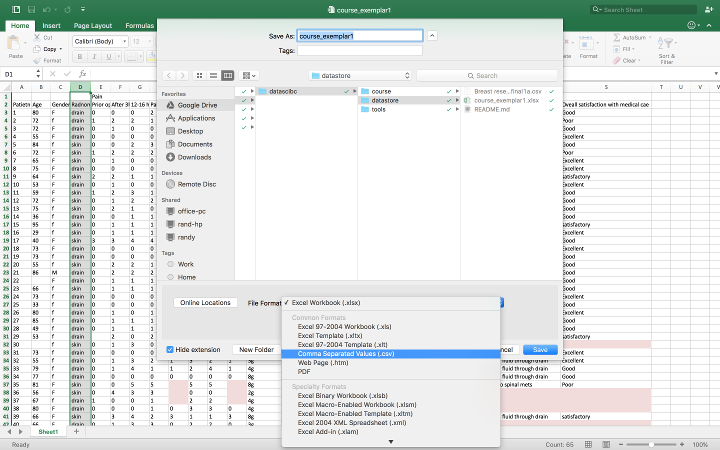
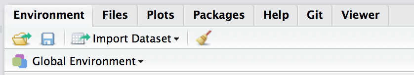
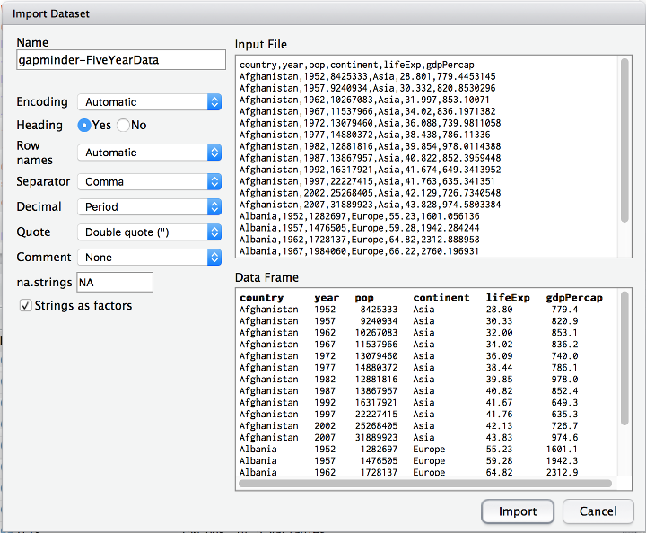

```{r setup, include=FALSE}
knitr::opts_chunk$set(echo = FALSE)
```
<!-- rename file with the lesson name replacing template -->

## Learning Objectives 

1. Introducing the data pipeline
2. Get data out of your spreadsheet
3. Importing: Point and click in R studio
4. Importing: Scripting your import (and introducing file paths)
5. Doing a quick nose around dataframes in R

<!-- * Getting data into R - (v1) Ahmed (v2) Ed (v3) Steve

keep theme of square tables frome excel to csv now to data.frame
how to get these in
/how to do this 'automagically'

- [ ] teach comments
- [ ] teach script files
- [ ] foobar

 -->

## The data pipeline

<!-- - [ ] TODO(2016-11-15): produce a graphic for this -->

Learning 'coding' is a pain, and for a 'one off' process there will nearly always be some tempting 'point-and-click' alternative.

Greatest benefits from learning to code:

- Reproducibility  
- Documenting as you go along
- Saving time 

## Traditional workflow

1. Collect data on paper
2. Transcribe paper forms into Excel or similar
3. Import Excel into SPSS or another stats package
4. Perform analyses and make graphs
5. Copy/paste these into your final document (Word, Powerpoint) etc

## Problems

- One early mistake, means repeating all steps by hand
- You can't remember what you did because you haven't looked at this for 5 days, 5 months or 5 years
- Other people can't collaborate or help because all the files are local, and even if they have them you weren't obsessive enough to write notes about each step

## A data pipeline (aka scripting)

Learn just enough code to write down your 'workflow'. Ensure the workflow starts with the raw data, and then any changes in the workflow or the data will automatically propagate.

1. Collect data electronically
2. Write a script that converts your data into figures and tables
3. Knit everything into a single report?

## Getting data out of your spreadsheet: CSV files

Arguably one of the oldest, and most ubiquitous is the 'comma separated values' (`.csv`) file. This is easily exportable from Microsoft Excel, Apple Numbers, Open Office, Google Sheets...etc.

It's a simple format. The top line are the column names, each seperated by a comma. The following lines are the observations in those columns, again, seperated by a comma.

It's strength is in it's simplicity. It only has data, no formulas, no tricks and is very well recognised amongst software packages as it is very easily supported. R has excellent support for `.csv`.

## Export CSV From Excel



## Exercise: Export an .xlsx file to .csv

1. Find the cleaned .xlsx file that was produced in the Excel Hell lecture and export it as a .csv file. If all else fails then we have a copy [here](https://figshare.com/s/28e6b022c0d3fe63909e).

Once a sheet has been exported, it can be imported into R.

## Getting CSV data into R

There're many ways to do this:

1. Point-and-click within RStudio, which we introduced in Lesson 1 (R for Newbies).
2. Use the `read_csv` function.

## Point-and-click

As a quick reminder from Lesson 1. Click the *Import Dataset* button, and select the *From local file ...* option.



Then accept the defaults in the dialog box that appears.

## Point-and-click 2



## Scripting

Point and click is lovely and easy but _sadly_ not reproducible. Much better is to write down where your data comes from. We are going to do this in 3 steps here.

1. Find the _path_ to your file. We covered file paths in [lesson 1](00-lesson-00-intro.html#files-and-directories), and this is just the formal address of your file on your computer. A quick way to do this in `R` is to use the `file.choose` function.
2. We will take the _path_ you have generated and name it `myfile`.
3. We will use a _function_ called `read_csv` to import the data into a data frame (which we in turn name `RCT` for convenience).

> Try right clicking a file in *Finder* (on a Mac) or *Windows Explorer* (on a PC). You'll normally see an option for 'info' or 'properties' that will show you the path to your file.

## Code example

```{r eval=FALSE, echo=TRUE}
install.packages("readr")   # install only needed the 1st time
library(readr)              # load the readr family of
                            # functions including read_csv

myfile <- file.choose()
myfile
dataframename <- read.csv(myfile)
```

You could have done this in one step, but it would have made things harder to read. Hard to read, means difficult to remember, and we are doing our best to avoid that!

## Other functions

> There is a function `read.csv` provided by R but `read_csv` is better. The built-in function has a couple of annoying 'habits'. If you wish to use it then don't forget to specify: (1) `header = TRUE` which tells the function to expect column names in row 1 instead of data, and (2) `stringsAsFactors = FALSE` which is a necessary but annoying reminder to R that you want it to leave 'strings' alone and not convert them to 'labelled' factors.

## Exercise: Import the .csv into R

a. Import the .csv file from the Excel Hell lesson as a dataframe and call it `RCT`.

## Exercise: Answer

a. Import the .csv file from the Excel Hell lesson as a dataframe and call it `RCT`. 

`RCT <- read_csv("path/of/file.csv")`

```{r eval=FALSE, echo=TRUE}
# Alternative solution:
myfile <- file.choose()
RCT <- read_csv(myfile)
```

## Everything is a "data-frame"

Ok now you've managed to get your data into `R`! What next?

Spreadsheets in R are called 'dataframes'.

A data-frame has columns, each identified by a name, and rows for observations. This means that however you import your data into R within your pipeline, those data will end up as a dataframe.  Let's do a quick tour of dataframes in R.

## Let's have a look at the data

We successfully brought in the RCT data and named it `RCT`. How do we look at it?

```{r eval=FALSE, echo=TRUE}
# Have a look at the first few rows
head(RCT)

# Have a look at the last few rows
tail(RCT)

# Have a look at the whole spreadsheet
View(RCT)
```

## Navigating within the dataframe

The 'rows' are contain measurements from different individuals, and the columns contain the measurements. Just like in Excel, any item (cell) can be accessed by its coordinates in the table which are always written as `[row, column]` (i.e. which row, then which column).

```{r eval=FALSE, echo=TRUE} 
RCT[1,1]         # top left cell
RCT[64,21]       # bottom right cell
RCT[1, ]         # first row (all columns)
RCT[ ,1]         # first column (all rows)
```

## Selecting columns

Most of the time the rows are 'observations' and we want to pick out 'characteristics' of those observations (i.e. the columns). Rather than having to remember the column number, we can just ask for a columm by name using the `$` operator: e.g. `dataframename$some_column`

```{r eval=FALSE, echo=TRUE} 
# First we need to know what column names exist
names(RCT)

RCT$Age
RCT$Gender
```

## Exercise: Taking a quick look at the data

1. What are the names of the columns? Hint: try `names()`

2. Display in the console the items in the column `PS_Prior_op`

3. Can you do the same for all the other columns in `RCT`?

4. Can you find out how many patients were randomised to each arm? Hint: you can use the function `table()` or `xtab()`

5. Can you find out how many subjects there are?

## Exercise: Answers

1. What are the names of the columns? `names(RCT)`

2. Display in the console the items in the column `RCT$PS_Prior_op`

3. Can you do the same for all the other columns in `RCT`? `RCT$Gender`, `RCT$Age`, etc.

4. Can you find out how many patients were randomised to each arm? `table(RCT$Randomisation)`

5. Can you find out how many subjects there are? `nrow(RCT)`

## Homework

1. Can you import and look at the `outreach.csv` dataset? What is the average heart rate? How many patients were accepted to ICU (the column is called `icu_accept`), and what was the mortality?

2. Have a look at our online course material where we introduce the idea of bringing data in via Google Sheets (http://datascibc.org/Data-Science-for-Docs/03-lesson-03-getting-data-into-r.html)