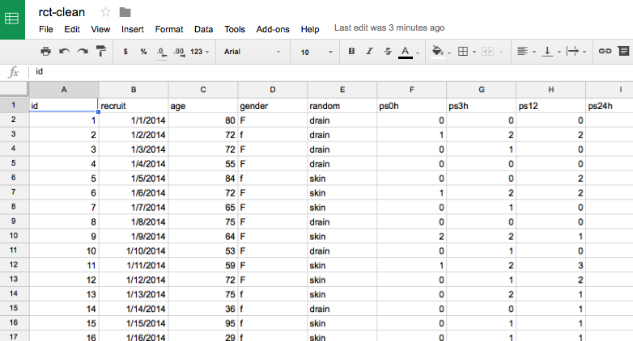

<!-- rename file with the lesson name replacing template -->

## Learning Objectives 

1. [Introducing the data pipeline](#pipeline)
2. [Doing a quick nose around dataframes in R](#dataframes)
3. [Get data out of your spreadsheet](#csv)
4. [Importing: Point and click in R studio](#clicking)
4. [Importing: Scripting your import (and file paths)](#scripting)
5. [Importing: Using Google Sheets](#google-sheets)

<!-- * Getting data into R - (v1) Ahmed (v2) Ed (v3) Steve

keep theme of square tables frome excel to csv now to data.frame
how to get these in
how to do this 'automagically'

- [ ] teach comments
- [ ] teach script files
- [ ] foobar

 -->

## Lesson 

This lesson will teach you to move your data from an Excel sheet or similar into R.

## The data pipeline

<!-- - [ ] TODO(2016-11-15): produce a graphic for this -->

We strongly believe that the greatest strength you will gain from the work today is _reproducibility._ Learning 'coding' is a pain, and for a 'one off' process there will nearly always be some tempting 'point-and-click' alternative. However, learning to code, means being forced to write down what you did to get from your data to your result. You'll only have to reproduce something once to appreciate the value of having everything documented. Whether it is an error in your data, an new observation, or your supervisor or collaborator asking you to repeat an analysis with a twist, you will always be revisiting and revising your work. And the initial investment in _writing_ (i.e. coding) your analysis means that these adjustments become simple.

### Traditional workflow

1. Collect data on paper
2. Transcribe paper forms into Excel or similar
3. Import Excel into SPSS or another stats package
4. Perform analyses and make graphs
5. Copy/paste these into your final document (Word, Powerpoint) etc

### Problems

- One early mistake, means repeating all steps by hand
- You can't remember what you did because you haven't looked at this for 5 days, 5 months or 5 years
- Other people can't collaborate or help because all the files are local, and even if they have them you weren't obsessive enough to write notes about each step

### A data pipeline (aka scripting)

Learn just enough code to write down your 'workflow'. Ensure the workflow starts with the raw data, and then any changes in the workflow or the data will automatically propagate.

1. Collect data electronically
2. Write a script that converts your data into figures and tables
3. Knit everything into a single report?

> OK. Step 3 is showing off, and probably too much for today but as an FYI everything you are reading now was written in R including the text, the code, the tables and the figures. When we want to update something, we just edit and 'knit'. Look at the [course](https://www.coursera.org/learn/reproducible-research) by Roger Peng at Johns Hopkins on Coursera if you want to learn more.

## Getting data out of your spreadsheet: CSV files

We need a 'common data language' that all spreadsheet languages can write to, and all statistical and programming languages can read. Arguably one of the oldest, and most ubiquitous is the 'comma separated values' (CSV) file. This is easily exportable from Microsoft Excel, Apple Numbers, Open Office, Google Sheets...etc.

It's a simple format. The top line are the column names, each seperated by a comma. The following lines are the observations in those columns, again, seperated by a comma.

It's strength is in it's simplicity. It only has data, no formulas, no tricks and is very well recognised amongst software packages as it is very easily supported. R has excellent support for CSV.

### Export CSV From Excel

**Exercise:** Export an .xlsx file to .csv

1. Find the cleaned .xlsx file that was produced in the Excel Hell lecture and export it as a .csv file. If all else fails then we have a copy [here](https://figshare.com/s/28e6b022c0d3fe63909e).

Once a sheet has been exported, it can be imported into R:

## Getting CSV data into R

There're 3 main ways to do this:

1. Point-and-click within RStudio, which we covered in Lesson 1 (R for Newbies).
2. Use the `read.csv` function.
3. Make a connection to a database or an online Google Sheets spreadsheet

### Point-and-click

As a quick reminder from Lesson 1. Click the *Import Dataset* button, and select the *From local file ...* option.

Then accept the defaults in the dialog box that appears.

### Scripting

Point and click is lovely and easy but _sadly_ not reproducible. Much better is to write down where your data comes from. We are going to do this in 3 steps here.

1. Find the _path_ to your file. We covered file paths in [lesson 1](00-lesson-00-intro.html#files-and-directories), and this is just the formal address of your file on your computer. A quick way to do this in `R` is to use the `file.choose` function.
2. We will take the _path_ you have generated and name it `myfile`.
3. We will use a _function_ called `read_csv` from the `readr` library to import the data into a data frame (which we in turn name `df` for convenience).

> Try right clicking a file in *Finder* (on a Mac) or *Windows Explorer* (on a PC). You'll normally see an option for 'info' or 'properties' that will show you the path to your file.


install.packages("readr")       # install only needed the first time
library(readr)                  # load the readr family functions including read_csv
myfile <- file.choose()
dataframename <- read_csv(myfile)


You could have done this in one step, but it would have made things harder to read. Hard to read, means difficult to remember, and we are doing our best to avoid that!

> There is a function `read.csv` provided by R but `read_csv` is better. The built in function has a couple of annoying 'habits'. If you wish to use it then don't forget to specify: (1) `header=TRUE` which tells the function to expect column names in row 1 instead of data, and (2) `stringsAsFactors=FALSE` which is a necessary but annoying reminder to R that you want it to leave 'strings' alone and not convert them to 'labelled' factors.

### Exercise: Import the .csv into R

1. Import the .csv file from the Excel Hell lesson as a dataframe and call it `RCT`
2. Name all the columns in the dataframe.

---

## Everything is a "data-frame"

Step **1** in your pipeline has to be getting your (now beautifully tidy) spreadsheet into R.

Spreadsheets in R are called 'dataframes'.

A data-frame has columns, each identified by a name, and rows for observations. This means that however you import your data into R within your pipeline, those data will end up as a dataframe.  Let's do a quick tour of dataframes in R.


# Have a look at the first few rows of data you've imported
head(RCT)



## # A tibble: 6 x 21
##   Pt_No   Age Gender Radnomisation PS_Prior_op PS_3hrs PS_12_16hrs
##   <int> <int>  <int>         <int>       <int>   <int>       <int>
## 1     1    80      1             1           0       0           0
## 2     2    72      1             1           1       2           2
## 3     3    72      1             1           0       1           0
## 4     4    55      1             1           0       0           0
## 5     5    84      1             2           0       0           2
## 6     6    72      1             2           1       2           2
## # ... with 14 more variables: PS_24_28hrs <int>, PS_2wks <int>,
## #   Mov_12_16hrs <int>, Mov_24_28hrs <int>, Mov_2wks <int>,
## #   Paracetamol_g <int>, Ibuprofen_mg <int>, Diclofenac_mg <int>,
## #   Oromorph_mg <dbl>, Amitryptaline_mg <dbl>, Pregabalin_mg <int>,
## #   Days_in_hosp <int>, Reason_hosp_stay <int>, Overall_satisfaction <int>



# Have a look at the last few rows
tail(RCT)



## # A tibble: 6 x 21
##   Pt_No   Age Gender Radnomisation PS_Prior_op PS_3hrs PS_12_16hrs
##   <int> <int>  <int>         <int>       <int>   <int>       <int>
## 1    59    77      1             2           0       0           1
## 2    60    85      1             1           0       3           3
## 3    61    55      1             1           0       0           3
## 4    62    79      1             1           0       1           1
## 5    63    NA      1             2           0       5           0
## 6    64    80      1             1           0       0           0
## # ... with 14 more variables: PS_24_28hrs <int>, PS_2wks <int>,
## #   Mov_12_16hrs <int>, Mov_24_28hrs <int>, Mov_2wks <int>,
## #   Paracetamol_g <int>, Ibuprofen_mg <int>, Diclofenac_mg <int>,
## #   Oromorph_mg <dbl>, Amitryptaline_mg <dbl>, Pregabalin_mg <int>,
## #   Days_in_hosp <int>, Reason_hosp_stay <int>, Overall_satisfaction <int>



# Have a look at the entire dataframe
View(RCT)


The 'rows' are contain measurements from different individuals, and the columns contain the measurements. Just like in Excel, any item (cell) can be accessed by its coordinates in the table which are always written as `[row, column]` (i.e. which row, then which column).


RCT[1,1]         # top left cell



## # A tibble: 1 x 1
##   Pt_No
##   <int>
## 1     1



RCT[64,21]       # bottom right cell



## # A tibble: 1 x 1
##   Overall_satisfaction
##                  <int>
## 1                    3



RCT[1, ]         # first row (all columns)



## # A tibble: 1 x 21
##   Pt_No   Age Gender Radnomisation PS_Prior_op PS_3hrs PS_12_16hrs
##   <int> <int>  <int>         <int>       <int>   <int>       <int>
## 1     1    80      1             1           0       0           0
## # ... with 14 more variables: PS_24_28hrs <int>, PS_2wks <int>,
## #   Mov_12_16hrs <int>, Mov_24_28hrs <int>, Mov_2wks <int>,
## #   Paracetamol_g <int>, Ibuprofen_mg <int>, Diclofenac_mg <int>,
## #   Oromorph_mg <dbl>, Amitryptaline_mg <dbl>, Pregabalin_mg <int>,
## #   Days_in_hosp <int>, Reason_hosp_stay <int>, Overall_satisfaction <int>



RCT[ ,1]         # first column (all rows)



## # A tibble: 64 x 1
##    Pt_No
##    <int>
##  1     1
##  2     2
##  3     3
##  4     4
##  5     5
##  6     6
##  7     7
##  8     8
##  9     9
## 10    10
## # ... with 54 more rows


Most of the time the rows are 'observations' and we want to pick out 'characteristics' of those observations (i.e. the columns). Rather than having to remember the column number, we can just ask for a columm by name using the `$` operator: e.g. `dataframename$some_column`


# First we need to know what column names exist
names(RCT)

RCT$Age
RCT$Gender


## Exercise: Taking a quick look at the data

1. What are the names of the columns? Hint: try `names()`

2. Display in the console the items in the column `PS_Prior_op`

3. Can you do the same for all the other columns in `RCT`?

4. Can you find out how many patients were randomised to each arm? Hint: you can use the function `table()` or `xtab()`

5. Can you find out how many subjects there are?

## Exercise: Answers

1. What are the names of the columns? `names(RCT)`

2. Display in the console the items in the column `RCT$PS_Prior_op`

3. Can you do the same for all the other columns in `RCT`? `RCT$Gender`, `RCT$Age`, etc.

4. Can you find out how many patients were randomised to each arm? `table(RCT$Randomisation)`

5. Can you find out how many subjects there are? `nrow(RCT)`

  
  Google Sheets
-------------
  
  We can also load data through a connection with Google Sheets. What's
good about this? **Collaboration** and **live-updating**. Let's use this
system to import a cleaned version of the breast RCT data we have been
working on.

We're going to use data in a shared sheet we've called `rct-clean`.

The sheet is available
[here](https://docs.google.com/spreadsheets/d/1LEZfjgeS-zjF0Jl79cFO7i2PBv0EngefZ4FUA0l1iyU/edit?usp=sharing).

### The `googlesheets` library

First we need the functions someone else has kindly written that allow R
to talk to google sheets. You will need to install the library first.

install.packages("googlesheets")

Now let's have a look at the sheets in your account. We'll use the
`gs_ls()` function.

The first time you run this you will be asked to authenticate (a browser
                                                               window will open and ask you to sign in to your google account). Behind
the scenes R now saves a hidden file into your working directory. The
next time you ever run your script, as long as you haven't moved your
code to a new directory, it won't need to ask.

library(googlesheets)
gs_ls()

## # A tibble: 3 × 10
##                sheet_title        author  perm version             updated
##                      <chr>         <chr> <chr>   <chr>              <dttm>
## 1                rct-clean     datascibc    rw     new 2016-11-15 15:16:00
## 2                rct-dirty     datascibc    rw     new 2016-11-15 13:54:25
## 3       rct-dirty-20161203     datascibc    rw     new 2016-11-15 13:00:33
## # ... with 5 more variables: sheet_key <chr>, ws_feed <chr>,
## #   alternate <chr>, self <chr>, alt_key <chr>

You can see a list of google sheets. It is now straightforward to read
these into R. Let's import the shared sheet `rct-clean`, and name it
`gsheet`.

gsheet <- gs_title("rct-clean")

## Sheet successfully identified: "rct-clean"

So far so good, but `sheet` isn't a data frame, it's just a connection
to that sheet. There's one more step.

df <- gs_read(gsheet)

## Accessing worksheet titled 'breast-clean.csv'.

## No encoding supplied: defaulting to UTF-8.

df

## # A tibble: 64 × 20
##       id   recruit   age gender random  ps0h  ps3h  ps12 ps24h ps168h
##    <int>     <chr> <int>  <chr>  <chr> <int> <int> <int> <int>  <int>
## 1      1  1/1/2014    80      F  drain     0     0     0     2      2
## 2      2  1/2/2014    72      f  drain     1     2     2     1      2
## 3      3  1/3/2014    72      F  drain     0     1     0     0      0
## 4      4  1/4/2014    55      F  drain     0     0     0     0      1
## 5      5  1/5/2014    84      f   skin     0     0     2     3     NA
## 6      6  1/6/2014    72      F   skin     1     2     2     2     NA
## 7      7  1/7/2014    65      F   skin     0     1     0     0      0
## 8      8  1/8/2014    75      F  drain     0     0     0     0      0
## 9      9  1/9/2014    64      F   skin     2     2     1     1      2
## 10    10 1/10/2014    53      F  drain     0     1     0     0      0
## # ... with 54 more rows, and 10 more variables: move12h <int>,
## #   move24h <int>, move168h <int>, tylenol <chr>, codeine <chr>,
## #   oramorph <chr>, other <chr>, los <int>, los_reason <chr>,
## #   satisfaction <chr>

> Bonus: The `googlesheets` library is actually doing one better than
> making a dataframe, and instead makes a *tibble*. Say it quickly and
> it sounds like *table*? It's just a fancy modern version of R's basic
> dataframe. You don't need to worry about the difference.

### Exercise: Taking a quick look at the data

a. What are the names of the columns?

b. Can you have a look at the column containing the age of the patients?

c. Can you find out how many patients were randomised to each arm? Hint: you can use the function `table()` or `xtab()`

d. Can you find out how many subjects there are?

### Answers

a. What are the names of the columns?

`names(df)`

b. Can you have a look at the column containing the age of the patients?

`df$age`

c. Can you find out how many patients were randomised to each arm? Hint: you can use the function `table()` or `xtab()`

`table(df$random)`

d. Can you find out how many subjects there are?

`nrow(df)`

## Homework

1. Can you import and look at the `outreach.csv` dataset? What is the average heart rate? How many patients were accepted to ICU (the column is called `icu_accept`), and what was the mortality?

---

[Previous topic](02-lesson-02-excel-hell.html) --- [Next topic](04-lesson-04-data-wrangling.html)
