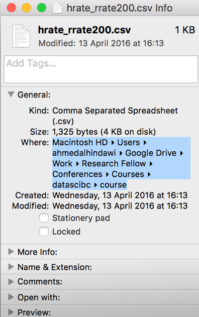
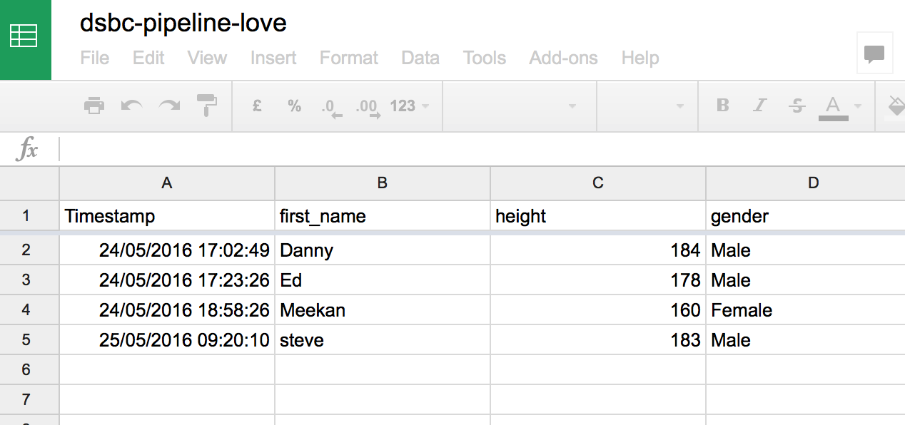

<!-- rename file with the lesson name replacing template -->

## Learning Objectives 

1. [Doing a quick nose around dataframes in R](#dataframes)
2. [Get data out of your spreadsheet](#csv)
3. [Click and import using R studio](#clicking)
4. [Scripting your import (and file paths)](#scripting)
5. [Using Google Sheets](#google-sheets)

<!-- * Getting data into R - (v1) Ahmed (v2) Ed
    - live coding importing the data
    - [ ] let's add googlesheets to this but not the reproducible angle yet
    - simple summary functoions in R for looking at your data
        + ls()
        + summary()
        + mean()
        + nrows()
        + ncols()
        + names()
 -->
 
## Lesson 

<a name="dataframes"></a>

## Everything is a "data-frame"

Once you have imported any sheet into R, the result is a data-frame. This is another word for a sheet - like Excel's sheet; it has columns, each identified by a name, and rows for observations.

To access a dataframe's particular column, we use the $ notation e.g:

```{r}
df$some_column
```

Here, `df` is our dataframe and the column name is "some_column".

Let's try some coding exercises

```{r}
#Let's look at some data that comes with R
data()

#Let's pick one to play with
x <- iris

#Have a look at the data
View(x)
```

### Exercise: Taking a quick look at the data

1. What are the names of the columns? Hint: try `names()`
2. Display in the console the items in the column `Sepal.Lengths`
3. What is the mean of and standard deviation of `Sepal.Lengths`?
4. What is the median, interquartile range, min and max of `Sepal.Lengths?`
5. Can you do the same for all the other columns in `x`?

<a name="csv"></a>

## Introducing the CSV

CSV, a Comma Seperated Values, is a file that will contain your data. This is easily exportable from Microsoft Excel, Apple Numbers, Open Office, Google Sheets...etc.

It's a simple format. The top line are the column names, each seperated by a comma. The following lines are the observations in those columns, again, seperated by a comma.

It's strength is in it's simplicity. It only has data, no formuals, no tricks and is very well recognised amongst software packages as it is very easily supported. R has excellent support for CSV.


## Export CSV From Excel


### Exercise: Export an .xlsx file to .csv

1. Find the cleaned .xlsx file that was produced in the Excel Hell lecture and export it as a .csv file.

## Find your File

You will need to know the absolute location of your file on your harddrive.



## Find your File

This will result in the following path:

```{r}
/Users/ahmedalhindawi/Documents/Development/Man_graph.xls
```

On Windows: Shift+Right click on file. Choose Copy As Path. A similar path will appear.

## Using in-built function

We can import Comma Separated Values (CSV) files into R very easily. These files can be generated by Microsoft Excel, Apple Numbers and Google Sheets usually through a File -> Export process.

Once a sheet has been exported, it can be imported into R:

There're 3 main ways to do this:

- Point-and-click within RStudio, which we covered in Lesson 1 (R for Newbies).
- Make a connection to a database or an online Google Sheets spreadsheet
- Use the `read.csv` function.

<a name="clicking"></a>

### Point-and-click

As a quick reminder from Lesson 1. Click the *Import Dataset* button, and select the *From local file ...* option.


Then accept the defaults in the dialog box that appears.


<a name="scripting"></a>

### Scripting

Point and click is lovely and easy but _sadly_ not reproducible. Much better is to write down where your data comes from. We are going to do this in 2 steps here.

1. We will take the _file path_ you have generated and name it `FILE`.
2. We will use a _function_ called `read.csv` to import the data into a data frame (which we in turn name `df` for convenience).

```{r}
FILE <- "/Users/ahmedalhindawi/Documents/Development/Man_graph.csv"
df <- read.csv(FILE, header=TRUE, stringsAsFactor=FALSE)
```

You could have done this in one step, but it would have made things harder to read. Hard to read, means difficult to remember, and we are doing our best to avoid that!

Now you can access the data you imported. For example, to display the entire column named 'column_name`. Replace with with the name of the column you're interested in.

```{r}
df$column_name
```

### Exercise: Import the .csv into R

1. Import the .csv file from the Excel Hell lesson as a dataframe and call it `RCT`
2. Name all the columns in the dataframe.

<a name="google-sheets"></a>

## Google Sheets

We can also load data through a connection with Google Sheets. What's good about this? **Collaboration** and **live-updating** (more next time). 

We're going to use data in a shared sheet we've called `dsbc-pipeline-love`.



You'll need to add the Google sheet to your account via the [sharing link here](https://drive.google.com/open?id=1UWkIPNNzMuqo9mehIOHWLt18T6iThQPOTRLa6Ar1Uds).

### The `googlesheets` library

First we need the functions someone else has kindly written that allow R to talk to R studio. You might need to install the library first (` install.packages("googlesheets")`).

```{r}
library(googlesheets)
```

Now let's have a look at the sheets in your account. We'll use the `gs_ls()` function. 

``` {r}
gs_ls()
```

The first time you run this you will be asked to authenticate. Behind the scenes R now saves a hidden file into your working directory. The next time you ever run your script, as long as you haven't moved your code to a new directory, it won't need to ask.

Let's import the shared sheet `dsbc-pipeline-love`, and name it `sheet`.

``` {r}
sheet <- gs_title("dsbc-pipeline-love")
```

So far so good, but `sheet` isn't a data frame. There's one more step.

``` {r}
goog <- gs_read(sheet)
```

Let's have a look at the first 6 rows (remember the `head()` function?)

``` {r}
head(goog)
```


### Exercise: Taking a quick look at the data

a. What are the names of the columns?

b. What is the mean and standard deviation of the subject heights?

c. Can you find out how many males and females there are? Hint: you can use the function `table()` or `xtab()`

d. Can you find out how many subjects there are?

### Answers

a. What are the names of the columns?

`names(goog)`

b. What is the mean and standard deviation of the subject heights?

`summary(goog$height)`

c. Can you find out how many males and females there are? 

`table(goog$gender)`

d. Can you find out how many subjects there are?

`nrow(goog$`


## Homework

1. Can you import and look at the `outreach.csv` dataset? What is the average heart rate? How many patients were accepted to ICU (the column is called `icu_accept`), and what was the mortality?


---

[Previous topic](02-lesson-02-excel-hell.html) --- [Next topic](04-lesson-04-04-reproducible-science.html)
