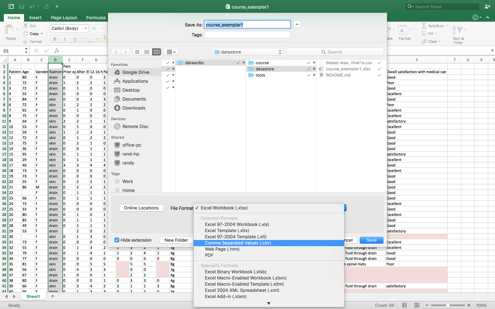

<!-- rename file with the lesson name replacing template -->

## Learning Objectives 

Getting Data into R can be accomplished in many ways.

1. Get data out of your spreadsheet
2. Click and import using R studio
3. Scripting your import (and file paths)
4. Using GoogleSheets

<!-- * Getting data into R - (v1) Ahmed (v2) Ed
    - live coding importing the data
    - [ ] let's add googlesheets to this but not the reproducible angle yet
    - simple summary functoions in R for looking at your data
        + ls()
        + summary()
        + mean()
        + nrows()
        + ncols()
        + names()
 -->
 
## Lesson 

## Everything is a "data-frame"

Once you have imported any sheet into R, the result is a data-frame. This is another word for a sheet - like Excel's sheet; it has columns, each identified by a name, and rows for observations.

To access a dataframe's particular column, we use the $ notation. E.g:

```{r}
df$some_column
```

Here, `df` is our dataframe and the column name is "some_column".

Let's try some coding exercises

```{r}
#Let's look at some data that comes with R
data()

#Let's pick one to play with
x <- iris

#Have a look at the data
View(x)
```

### Exercise: Taking a quick look at the data

a) What are the names of the columns? Hint: try `names()`

b) Display in the console the items in the column `Sepal.Lengths`

c) What is the mean of and standard deviation of `Sepal.Lengths`?

d) What is the median, interquartile range, min and max of `Sepal.Lengths?`

e) Can you do the same for all the other columns in `x`?


## Introducing the CSV

CSV, a Comma Seperated Values, is a file that will contain your data. This is easily exportable from Microsoft Excel, Apple Numbers, Open Office, Google Sheets...etc.

It's a simple format. The top line are the column names, each seperated by a comma. The following lines are the observations in those columns, again, seperated by a comma.

It's strength is in it's simplicity. It only has data, no formuals, no tricks and is very well recognised amongst software packages as it is very easily supported. R has excellent support for CSV.

## Export CSV From Excel



### Exercise: Export an .xlsx file to .csv

a) Find the cleaned .xlsx file that was produced in the Excel Hell lecture and export it as a .csv file.

## Find your File

You will need to know the absolute location of your file on your harddrive.


## File your File
This will result in the following path:

```{r}
/Users/ahmedalhindawi/Documents/Development/Man_graph.xls
```

On Windows: Shift+Right click on file. Choose Copy As Path. A similar path will appear.

## Using in-built function

We can import Comma Separated Values (CSV) files into R very easily. These files can be generated by Microsoft Excel, Apple Numbers and Google Sheets usually through a File -> Export process.

Once a sheet has been exported, it can be imported into R:

There're 2 main ways to do this:

- Point-and-click within RStudio, which we covered in Lesson 1 (R for Newbies).
- Make a connection to a database or an online Google Sheets spreadsheet (beyond the scope of this course).
- Use the `read.csv` function.

```{r}
FILE <- "/Users/ahmedalhindawi/Documents/Development/Man_graph.csv"
df <- read.csv(FILE, header=TRUE, stringsAsFactor=FALSE)
```

This will read your file, then a dataframe object will be available to run queries on. To display the entire column, type:

```{r}
df$column_name
```

## Google Sheets

We can also load data through a connection with Google Sheets.

```{r}
#Load the required library
library(googlesheets)

#Get a list of spreadsheets in your Google account
#The first time you run this you will be asked to authenticate via the browser
gs_ls()

sheet <- gs_title("dsbc-pipeline-love")

goog <- gs_read(sheet)

xtab(~gender, data = goog)

hist(goog$height)
```

### Exercise: Taking a quick look at the data

a) What are the names of the columns?

b) What is the mean and standard deviation of the subject ages?

c) Can you find out how many males and females there are? Hint: you can use the function `table()`

d) Can you find out how many subjects were randomised into each arm?

e) What is the mean, median, IQR of the Length of Stay?

## Homework

Hopefully you have learned enough about today to load data into R and then get an overview.

Go home and look at the `outreach.csv` dataset that we downloaded from Figshare in Lesson 0 (Introduction) and try to answer the following questions, which we will go through at the start of the next lesson:

### Questions


---

[Previous topic]() --- [Next topic]()


