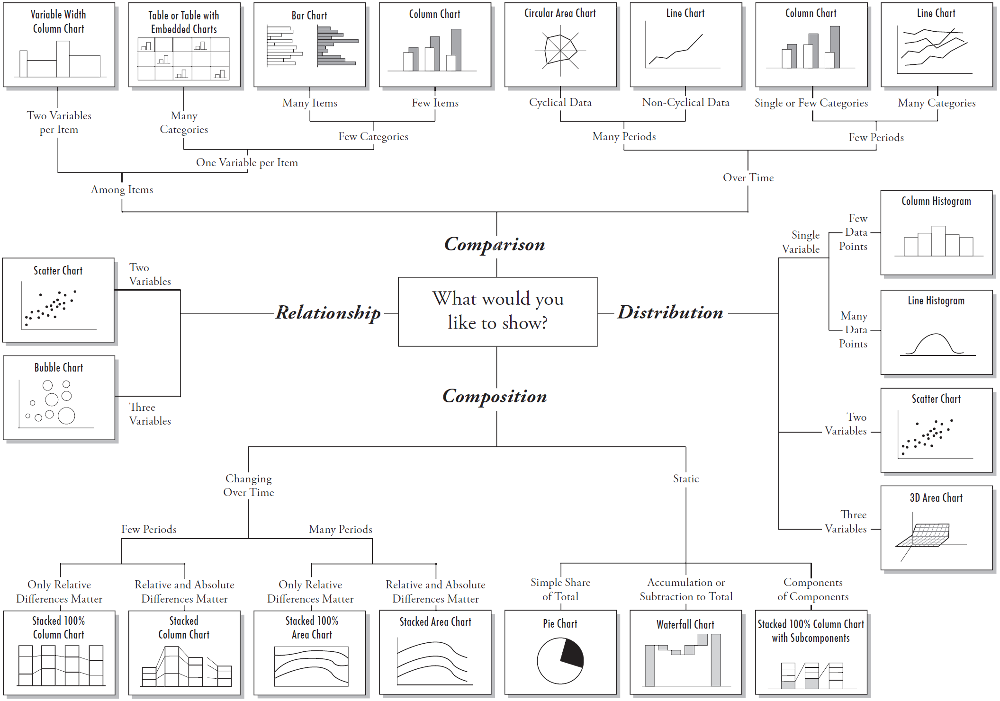

<!-- rename file with the lesson name replacing template -->

<!--## Learning Objectives -->

<!--     
* principles of data viz
* aesthetics in ggplot
* Revisit ggplot with all the nicer options for facetting, colour size
        - [ ] maybe get them to plot hrate and mortality with sample size etc
        - [ ] 

 -->

This is [Edward Tufte](http://www.edwardtufte.com/tufte/), professor emeritus at Yale University, statistician and all-round godfather of data visualisation.

We'll highlight some important dos and don'ts using a series of quotes from his classic *The Visual Display of Quantitative Information*, but here are his thoughts on our overall objective to start things off:

> "Excellence in statistical graphics consists of **complex ideas communicated with clarity, precision, and efficiency**"

As well as Tufte's writing, much of what follows draws heavily on [CS109 - Exploratory Data Analysis](https://github.com/cs109/2015/blob/gh-pages/Lectures/03-EDA.pdf).

## Storytelling

Tufte encourages us to produce visualisations which *offer a narrative quality, a story to tell about the data*. Our example narrative here is the disastrous French invasion of Russia in 1812. The Grande Armée, initially numbering ~680,000, marched East towards Moscow for 3 months met only with scorched earth left behind by the fleeing Russian forces. Scarce provisions eventually forced the French to retreat through the bitter Russian winter.

Before we get to the visualisation, here's a personal account of that retreat from the notebooks of captain Jean-Roch Coignet.

> "In a dispirited condition we reached Smolensk on the 9th of November. The halting places were miserably supplied; the horses died of hunger and cold, and when we came to any cottages, they devoured the thatch. The roads were like glass. The horses fell down, and could not get up. Our worn-out soldiers no longer had strength to their arms. The barrels of their muskets were so cold that they stuck to their hands. It was 28 degrees below zero.
>
> We had to march fight on, making faces prevent our noses and ears from freezing. The men became insensible to every human feeling. No one murmured against our misfortunes. The men fell frozen stiff all along the road."

...and here is the same story, told graphically and on a larger scale by [Charles Minard](https://www.wikiwand.com/en/Charles_Joseph_Minard).

The beige line represents the march on Moscow, the black line the retreat, with the width of the lines proportional to the number of remaining men. Winter temperatures are also shown.

## Decluttering

Tufte says we should aim to maximise the *data:ink ratio* in our visualisations, which involves purging them of "chartjunk" - extraneous visual information which distracts from meaning. Here's a good example of a chartjunk, courtesy  of [WTF Visualizations](http://viz.wtf/).

There are several problems here, most of which stem from the author's choice of translucent, rainbow-coloured triangular prisms as the best way to represent his/her data:

- A triangular prism is a 3-dimensional shape, used here to represent 1-dimensional data. So, which of the prism's attributes corresponds to those data? Is it the height, the area of its face, its volume or something else again? This makes comparison of the quantities represented by the prisms very unintuitive, and *the author has even acknowledged this* by labelling each prism with its respective value
- Overlapping the prisms by different amounts per shape makes the amount of each colour in the figure a (even) poorer guide to the quantities represented
- To find out which company each prism represents, our eyes have to jump back and forth from the prisms, to the key, and back again.

A better choice of design, avoiding all the above problems, would have been e.g. a clustered column chart. This would need only two colours of column (for the communication systems score and the driver assistance systems score) which is simple enough to hold in your head without having to constantly refer back to the key.

Here's a demonstration of how to declutter a column chart (sorry, this one isn't clustered).

## Don't mislead

We should try and produce visualisations which *avoid distorting what the data have to say*. Here's a particularly unsubtle example of data distortion courtesy of Fox News.

And another, from a company trying to sell you antivirus software.

The problem here is obvious: we intuitively expect the relative areas of the columns in the Fox News chart, and the relative areas of the submerged/non-submerged bits in the weird antivirus iceberg metaphor, to correspond to the relative sizes of the figures represented. They don't. One lesson to take from this is that you shouldn't use 'shortened scales' on column charts.

## Scaling Up

As data storage gets ever-less expensive and sensors (ranging from sats probes to web analytics) become ever-more ubiquitous, we need to get good at *making large datasets coherent*. Here's a fantastic heatmap from the [Wall Street Journal](http://graphics.wsj.com/infectious-diseases-and-vaccines/), which does just that.

Each square shows number of cases per 100,000 people. A large part of the impact of this visualisation lies in its careful choice of palette, which brings me on to...

## Rational use of Colour

You can use the [Colour Brewer](http://colorbrewer2.org/) tool to generate pretty, customisable colour palettes for your data visualisations. You can select from: 

- Qualitative colour palettes, used for distinguishing categorical data
- Sequential colour palates, for ordinal data where we want to emphasise the relatively high values
- Diverging colour palates, for ordinal data where we want to emphasise both the very high and very low values, and where the midpoint between these is well-defined (like in the measles visualisation above)

The next 
Colour theory is a huge topic. Here are some useful links that offer a good starting point.

- [Practical Rules for Using Color in Charts](http://www.perceptualedge.com/articles/visual_business_intelligence/rules_for_using_color.pdf)
- [Choosing colours for data visualisation](https://www.perceptualedge.com/articles/b-eye/choosing_colors.pdf)
- [Subtleties of Colour, a blog series](http://earthobservatory.nasa.gov/blogs/elegantfigures/2013/08/05/subtleties-of-color-part-1-of-6/)
- [Choosing colour palettes in R](http://www.r-bloggers.com/choosing-colour-palettes-part-i-introduction/)

## Pie Chart Horror

Tufte suggest that we avoid pie charts due to their *low data density and failure to order numbers along a visual dimension*, but that hasn't stopped their continued use and abuse in bad Powerpoint presentations throughout the world. 

For example, there is no way that we can get a sense of the relative quantities represented by most of the slices in this chart (even with the use of a second, nested pie chart! *Don't do this.*)

There are lots of problems with this next graphic (again, credit to [WTF Visualizations](http://viz.wtf/)) but note particularly that, even with only three 'slices' in each pie chart, it is surprisingly difficult to compare the sizes of the orange slices.

So, if you must use pie charts at all, then at least stick to [these rules](https://eagereyes.org/techniques/pie-charts), and preferably to a maximum of 2 slices.

## Which chart?

Here's a useful guide, courtesy of [Extreme Presentations](http://extremepresentation.typepad.com/files/choosing-a-good-chart-09.pdf).

## Exercises

### Questions

### Answers

---

[Previous topic](05-lesson-05-just-enough-statistics.html)
