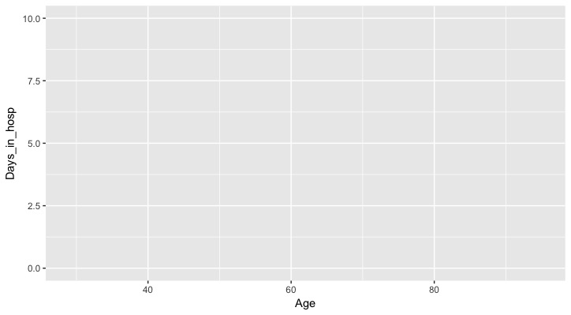
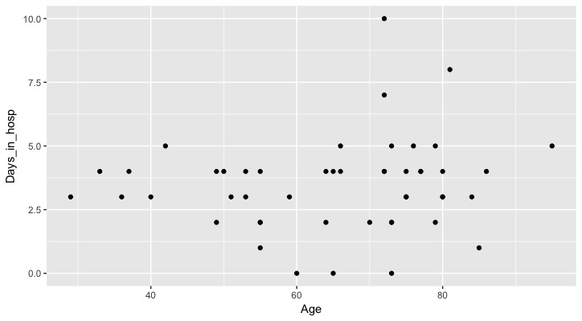
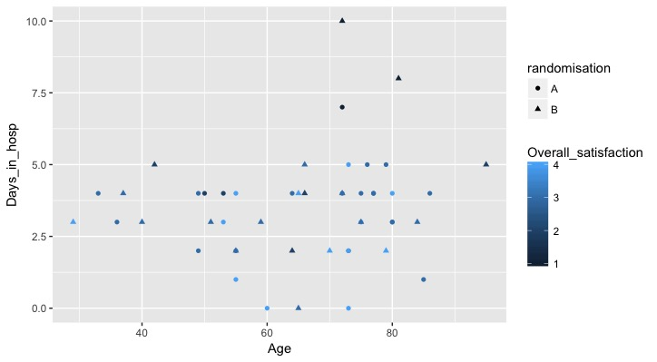
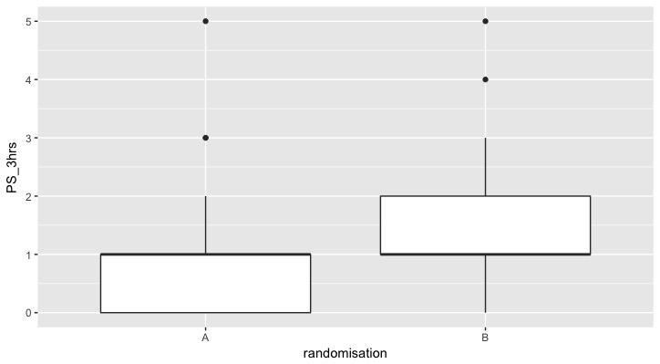

# The Grammar of Graphics

`Ggplot2` is an r library that allows us to easily make publication quality plots. It is based on the "Grammar of Graphics" which describes a vocabulary for creating plots from data.

Start by loading up the GGPLOT2 library.

    install.packages("ggplot2")
    library(ggplot2)

## Building Layers

Ggplot works by translating your data, a layer at a time, into a visualisation. What do we mean by layers? All data (providing it is in a "tidy" form) can be represented by the following layers:
- The **Data** layer
- The **Aesthetic** mapping layer
- The **Geometries** Layer

Lets look at how we would build these up for a worked example. Let's use the data we've been using thus far in the course. The breast RCT data is already loaded into our workspace from before. We've loaded it in as the object `RCT`. Let's take a look at it to remind outselves.

    > head(RCT)
    # A tibble: 6 x 21
      Pt_No   Age Gender Radnomisation PS_Prior_op PS_3hrs PS_12_16hrs PS_24_28hrs PS_2wks
      <int> <int>  <int>         <int>       <int>   <int>       <int>       <int>   <int>
    1     1    80      1             1           0       0           0           2       2
    2     2    72      1             1           1       2           2           1       2
    3     3    72      1             1           0       1           0           0       0
    4     4    55      1             1           0       0           0           0       1
    5     5    84      1             2           0       0           2           3      NA
    6     6    72      1             2           1       2           2           2      NA
    # ... with 12 more variables: Mov_12_16hrs <int>, Mov_24_28hrs <int>, Mov_2wks <int>,
    #   Paracetamol_g <int>, Ibuprofen_mg <int>, Diclofenac_mg <int>, Oromorph_mg <dbl>,
    #   Amitryptaline_mg <dbl>, Pregabalin_mg <int>, Days_in_hosp <int>,
    #   Reason_hosp_stay <int>, Overall_satisfaction <int>

## The DATA Layer

Before doing anything, you need to make sure you have:
- "Tidy" data
- Given thought to what you want to final plot to look like. This often means wrangling your data between "Tall" or "Wide" data.frames.

To build the "data" layer we use the following syntax:

    ggplot(data = RCT)

And this is what is returned:

This blank image is exactly what we are looking for. The data has been successfully loaded into ggplot, but it has no idea yet how to display that information. We need to move onto the "Aesthetic" layer.

## The AESTHETIC Layer

The aesthetic layer takes a column of our data and maps it to a particular visual dimention. This could include:
- x (The abscissa of a cartesian axis)
- y (The ordinate of a cartesian axis)
- size (The relative size of each point)
- shape (The shape of each point)
- alpha *(otherwise known as transparency)*
- color *(american spelling)*

There are others, but these are the basics. Let's add the aesthetic mappings to our data. We'll choose the variables `Age` and `Days_in_hosp` to start. Both are continuous numerical data, so lend themselves well to being plotted on a scatter graph, with one mapped to each axis.

    ggplot(data = RCT, mapping = aes(x = Age, y = Days_in_hosp))

Perfect, things are starting to take shape. The data has been mapped to a visual dimention. In this case, the x and y axis of the plot. We still aren't seeing any data points as we need to add our last mandatory layer, the geom layer.

## The GEOMETRY Layer

The geom layer gives final instructions on how we want the data to be displayed. Do we want points, crosses or something else entirely. Let's add the geom layer:

    ggplot(data = RCT, mapping = aes(x = Age, y = Days_in_hosp)) + geom_point()

So we finally have a plot. It doesn't look like there's a very clear association between the two variables.

## More examples

Below, there are a few more examples where we have mapped different aesthetics and used different geoms.

Let's start by adding a shape for the randomisation:

    ggplot(data = RCT, mapping = aes(x = Age, y = Days_in_hosp, shape = randomisation)) + geom_point()

Ggplot has created a legend for us. Lets go the whole hog and add in overall satisfaction as a color mapping.

    ggplot(data = RCT, mapping = aes(x = Age, y = Days_in_hosp, shape = randomisation, color = Overall_satisfaction)) + geom_point()

Do you see how quite quickly, we've produced a series of publication quality graphics, essentially using 1 line of code.

What about comparing pain scores?

    ggplot(data = RCT, mapping = aes(x = randomisation, y = PS_3hrs)) + geom_boxplot()

Here we mapped the randomisation to the x axis as a categorical variable, which necessitated the use of the `geom_boxplot` geom to display the data.

## Exercise

- There are many different anaesthetics (x, y, col, size, shape etc.). Explore your own data, using the different mappings.
- There are many different geoms that help to represent our data. Have a look at some of the others aside from `geom_point()` and `geom_boxplot()`.
- What do you think `geom_jitter()` does and why?

[Previous topic](05-lesson-05-dataviz.html) --- [Next topic](07-lesson-07-just-enough-statistics.html)
