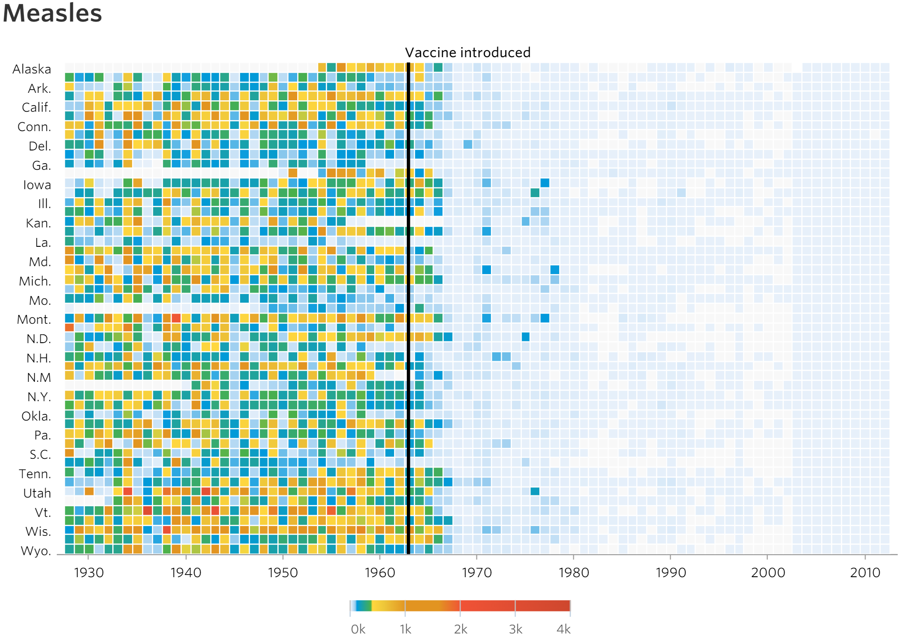
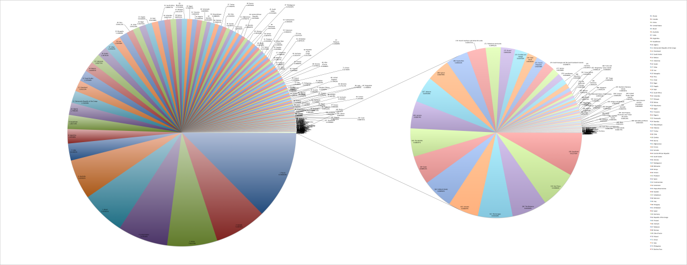

<!-- rename file with the lesson name replacing template -->

## Learning Objectives 

<!--     
* principles of data viz
* aesthetics in ggplot
* Revisit ggplot with all the nicer options for facetting, colour size
        - [ ] maybe get them to plot hrate and mortality with sample size etc
        - [ ] 

 -->

## Lesson 

> "Excellence in statistical graphics consists of **complex ideas communicated with clarity, precision, and efficiency**"

--------

> "Avoid distorting what the data have to say"

--------

--------

> "Make large datasets coherent"

--------

> "Encourage the eye to compare different pieces of data"

--------

> "Offer a narrative quality, a story to tell about the data"

--------

> "Induce the viewer to **think about the substance** rather than something else"

--------

> "Avoid content-free decoration, including chartjunk"

--------

> "Display an **accessible** complexity of detail"

--------

> Pie charts: "low data density and failure to order numbers along a visual dimension"

--------

--------

--------

# Our aim

TODO: Insert image of finished chart communicating something meaningful about the data

--------

<pre><code class="r">install.packages("plotly")
library(plotly)
</code></pre>

--------

TODO: Intro to plotly

--------

# References

- [Edward Tufte - The Visual Display of Quantitative Information](http://www.edwardtufte.com/tufte/)
- [CS109 - Exploratory Data Analysis](https://github.com/cs109/2015/blob/master/Lectures/03-EDA.pdf)
- [WTF Visualizations](http://viz.wtf/)
- [Battling Infectious Diseases in the 20th Century: The Impact of Vaccines](http://graphics.wsj.com/infectious-diseases-and-vaccines/)
- [Extreme Presentations - Chart Suggestions](http://extremepresentation.typepad.com/files/choosing-a-good-chart-09.pdf)

## Exercises

### Questions

### Answers

---

[Previous topic]() --- [Next topic]()

