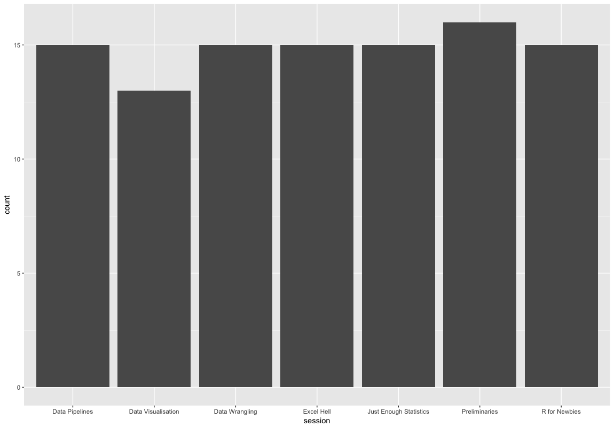
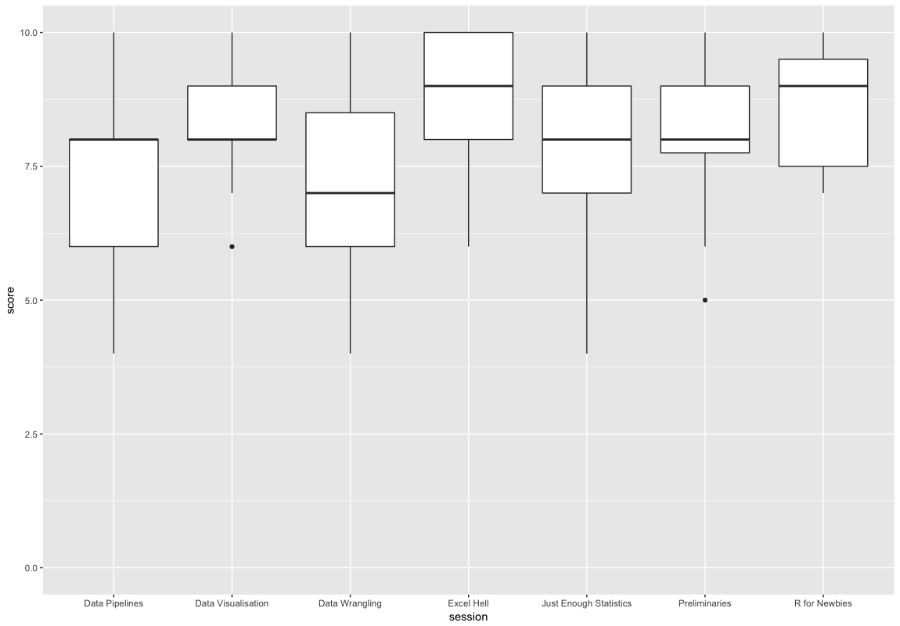
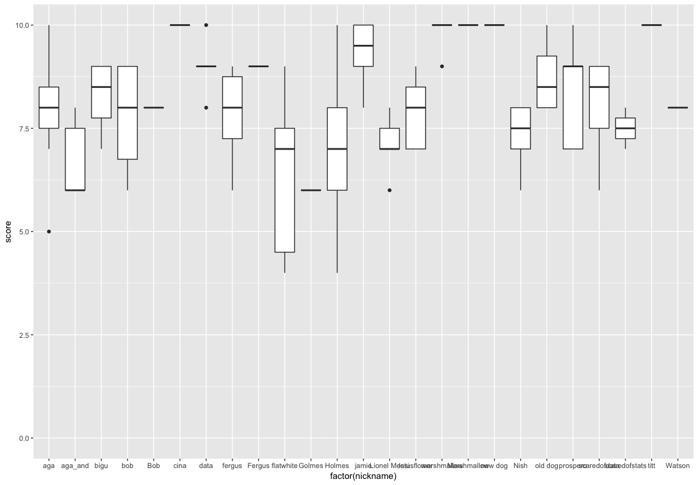

# Data science for Docs

The general public would assume that the medical profession are numerically literate. University-educated, technically-trained in biological science and more, and with the unique legal privilege of prescribing medicines where incorrect dosing leads to disaster, there would seem to be no excuse. However, most medics would deny any affinity with maths, and exude a distaste for statistics. This is a truism even amongst anaesthetists whose professional training includes physics and pharmacokinetics.

<!-- Set up need -->
Despite this public denial, we are nonetheless a data-literate profession. We read and interpret scientific papers, we run audit projects and write business cases for improvement projects. These are all intrinsically quantitative undertakings. However, our adopted posture gets in the way of our doing these things as well as possible, and engaging with statistics and data.

<!-- Data science, sexed up stats? -->
Data science would appear to be a rebranding of statistics. Despite underpinning quantum mechanics, modern finance, and the humble weather forecast, statistics has never managed to seem cool. At worst, it is cited as 'lies, damn lies and ...'. However, rename it to data science, chat about machine learning and drop in an 'artificial neural network', and you are part of the cool, new tech team.

The term data science can have a second intepretation. Most of the work of a practicing statistician is in preparing data. This is no different to working in a wet lab where the 'killer' experiment can't be done until you have validated your reagents and calibrated your machines. The lab scientist carefully documents his or her work so that it can be reproduced, and the ability to reproduce a finding is what makes a result 'scientific'. Data science is the same. The preparatory work needs to be documented and reproducible for the final table, figure or statistical test to have meaning. The skill of documenting your work, of making it scientific, is valuable. We believe it deserves wider application in the clinical world. 

<!-- the old workflow -->
The traditional work flow of the running an audit, or performing a small clinical study, would normally start with a paper form. We would test the form for usability, and then laboriously transcribe the responses into a spreadsheet. Even a simple task such as reporting the mean age by treatment group would involve writing formulae, or copy-pasting blocks of data before summarising. Adding new data would mean repeating the entire process by hand, and if you came back to the project a few months later it would be difficult to remember the decisions you made to reproduce your previous work. More formal analysis would require both finding a friendly statistician and a license for SPSS (or another proprietary, menu-driven statistical software package).

<!-- the new workflow -->
We believe that 'data science' actually summarises a much better alternative work flow. This involves writing down your work, and, in writing it down, creating the well-documented, reproducible investigation that qualifies as science. This inevitably means writing code, but with modern tools this is achievable with a very small amount of training. It is with this premise that we created the 'Data Science for Docs' course.
<!-- @danny: At the moment I think the Introduction is much too long compared to what we did on the course. I think the Intro should be shortened in favour of more written about the course structure -->

<!-- summarise the course  -->
The course uses the widely respected open-source statistical computing language [R](https://www.r-project.org), and a freely available application for working with **R** called [R studio](https://www.rstudio.com). We teach the concept of a data pipeline so that reproducibility becomes an immediate advantage. A single document, or script, encodes the steps necessary to take data from an online web form into R, and out into a report, a simple analysis, or a beautiful data visualisation. When new data is entered, a single key stroke is needed to re-run the entire analysis and update the output. When you come back to your work after a break, the steps required to produce your report are clearly documented. And when you want to share your work, it's as simple as sending a copy of your code to a collaborator. 

<!-- resources -->
The tools necessary to do this work are freely available. Data can be collected on an online form ([Google Forms](https://www.google.co.uk/forms/about/)), stored automatically in a [Google Sheet](https://www.google.co.uk/sheets/about/), cleaned and analysed in R, and the graphs plotted interactively using online platforms such as [Plotly](https://plot.ly).

<!-- links to data carpentry -->
We have borrowed heavily from the established and respected [Software](https://www.software.ac.uk/software-carpentry) and [Data Carpentry](https://www.software.ac.uk/data-carpentry) courses, that teach a similar approach for scientists from undergradudate to post-docs. However, we focus our course on scenarios (such as audit, surveys, and small clinical research projects) that are a feature of clinical work. This requires care where patient information is being used, but these are surmountable problems not impossible barriers. 

<!-- course syllabus -->
The course syllabus includes:

|Lesson                                           |Description                        |
|:------------------------------------------------|:----------------------------------|
|**Welcome & setup time for those who need help** |We help students set up their computers with the required software to participate in the subsequent lessons. This ensures that they have the tools to immediately put into practice what they learn after the course finishes.|
|**Preliminaries + Motivational Demo**            |We give a general overview about the motivations behind learning the Data Science skills that we teach, and build enthusiasm for the processes and techniques through a demonstration of what is achievable with the lessons from the course and a bit of additional practice.|
|**R for Newbies**                                |We introduce students to the basic concepts of R and coding, and introduce the RStudio user interface, types of data that computers recognise, the difference between running commands in the console and writing scripts.| 
|**Excel Hell**                                   |We go deeper into the concepts behind types of data and show how spreadsheets can be improved upon to allow for tidy data to be analysed in R. We also go through some common mistakes people make when using spreadsheets.|
|**Data Pipelines**                               |We teach students how to get data into R through a number of different methods, and using a number of different data sources. We then teach them how to look at the data in R.|
|**Data Wrangling**                               |We teach students how to manipulate and clean the data in R using the `dplyr` package, as well as other standard R code.| 
|**Just Enough Statistics**                       |We teach the concept of distributions and some simple tests that they might need to do for analysing their own data, as well as the commands for these in R.|
|**Data Visualisation**                           |We end off the course by talking about the importance of data visualisation and the different ways of communicating their findings effectively.|

<!-- datathon -->
More recently we have run the course as a pre-workshop for a 'hack day' where clinicians, biostatisticians, and software engineers work together on clinical problems. These have been using critical care data from the [MIMIC database](https://mimic.physionet.org) run by MIT (Boston, USA), and more recently from the NIHR's Critical Care Health Informatics Collaborative (CC-HIC). For the clinician, this course offers sufficient insight the tools available, and the challenges facing their non-clinical colleagues, that a better conversation can be had.

## Feedback
<!-- feedback from course -->
Feedback on 'Data Science for Docs' was gathered using the metholodogies taught on the course, creating a parallelism and a realism that we hope empowered attendees and convinces them that these techniques are actually helpful. We used an online [Google Form](https://www.google.co.uk/forms/about/) that fed live data to a [Google Sheet](https://www.google.co.uk/sheets/about/). An [R](https://www.r-project.org) script written in [R Studio](https://www.rstudio.com) pulled the data from the sheet and produced the following graphs

### Number of feedback points per session

### Session scores (0-10) plots

### Scores per Attendee

## Conclusion

The course thus far has been supported but the [Software Sustainability Institute]() who pioneered the software and data carpentry courses mentioned above. We have also had enthusiastic support from the [National Institute of Academic Anaesthesia](). The materials for the course are freely available partly because we think this is the 'right thing' to do, and partly to provide a reference for people before and after the course. Finally, we also add all course participants to an online forum so that there is an obvious place to turn to when questions arise.

In the coming year, we will extend the course to a two-day format with a 'bring your own data' option on the second day. With a very high faculty-to-student ratio, we believe there is a very good chance that delegates will leave not just with a new set of skills, but with a completed analysis.
